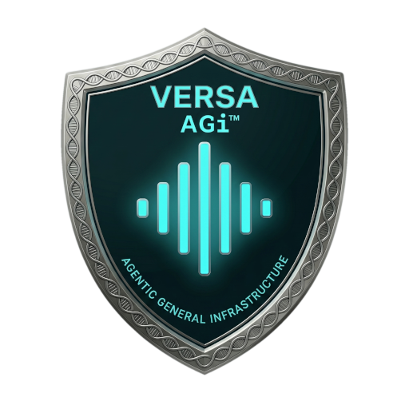

<div align="center">
  <a href="https://versavoice.ai/versa-agi">
    
  </a>
  <br>
  <h1>Versa - Business Admin</h1>
  <p>
    <strong>VBA</strong> — a related project that forms part of
    <strong><a href="https://versavoice.ai/versa-agi">Versa AGi</a></strong>
  </p>
  <p>
    <i>Staff admin for a Versa AGi-powered business: public presence, people, work, organization, collaboration parties, and environmental context.</i>
  </p>
  <p>
    <a href="https://versavoice.ai/versa-agi"><strong>Versa AGi</strong></a> ·
    <a href="https://github.com/swartzlib7/versa-agi"><strong>AGi on GitHub</strong></a> ·
    <a href="docs/ops/BUSINESS_ADMIN_OPS_MANUAL.md"><strong>Ops Manual</strong></a>
  </p>
  <p>
    
  </p>
  <p align="center">
    
    
    
    
    
    
    
    
    
  </p>
</div>

<br>

**Not agitop.** agitop is **Versa AGi - Mission Control**, the Versa AGi **internal** operator console (Agents, host Projects/Tasks, host Organization, system ops). VBA is the **business** admin system.

---

## Start here

| Who | What to open | How to use it |
|-----|----------------|---------------|
| **Operators / agents** (install, configure, maintain, enhance) | **[Ops Manual](docs/ops/BUSINESS_ADMIN_OPS_MANUAL.md)** | Setup, login, roles, day-2 care, restarts, upgrades. Read §0 then §2. |
| **Staff using VBA** | **[User Manual](docs/ops/BUSINESS_ADMIN_USER_MANUAL.md)** | How to work in the product. Page Builder §7 is written; other chapters planned. |
| **Agents** working this repo | **[AGENTS.md](AGENTS.md)** | Product door. |
| **Agents** on a Versa AGi host | Host skills **`business_admin`** (install) and **`business_admin_operate`** (API / operate) | After the workspace exists, load this repo’s `AGENTS.md` and the Ops Manual. |
| **Everyone** | This README | Product name, roles, quick start, docs map. |

The agent door and manuals **live in this repo**. Install and operate procedure stay on the Versa AGi host (`business_admin`, `business_admin_operate`). The Ops Manual is the operator source of truth. The User Manual is the staff how-to.

---

## Roles — Admin vs member

There is **one login page** (`/login`). Admin and member do not use different login screens. The difference is the **`role` on the user record** after a session is created (`admin` | `member`).

| | Administrator | Member |
|--|---------------|--------|
| Who | Workspace operators | Staff who work inside VBA |
| Session | `role === "admin"` (`isAdmin` in `src/lib/auth.ts`) | Authenticated, not admin |
| Typical access | Read + write: users, catalog, settings, sample data, organizations, projects, tasks, records | Read most resources; limited writes (self profile; assignee task status) |
| Cannot | — | Create users; change another user’s role/type/status; admin-only settings and sample-data mutations |

Install always creates **exactly two** administrator accounts:

1. **Administrator** (human) — `admin@example.com`
2. **COA** (agent) — `coa@example.com`, type `agent`, role `admin`

On first backend login, change both passwords. While **Demo mode** is on, `/login` shows those install emails/passwords (they may already have been changed) plus an alert to change them. The hint box is hidden when Demo mode is off.

Everyone else (Jordan, Casey, Riley, Ops Assistant, Research Assistant, …) is **sample data**, inserted from Settings → Modes → Insert Sample Data and removed by Delete Sample Data.

Full operator detail: Ops Manual **§1.5**. API `auth` labels: `session` / `admin` / `admin-or-self` / `admin-or-assignee` in Settings → API.

---

## Product boundaries (short)

- **Own** database (Postgres via `.env.local`; fixture is opt-in for tests).
- Secure **login + RBAC** (same form; role after login).
- **Public** site when signed out.
- **Agents = user type only** (`human` | `agent`). No agent-fleet chrome. List agents with `GET /api/users?type=agent`.
- Data created here is **separate** from host Versa AGi; integrate via **product API** or Script Tasks.
- **Host Organization migrate:** `scripts/migrate_agi_org.mjs`. Do not disable agitop Organization unless the Primary User asks after a verified migrate.

## Conceptual ERD (keystone)

Three zones (circles):

1. **Organization** — departments as spheres: Executive, Communications, Dissemination, Treasury, Production, Qualification
2. **Collaboration** — Vendor (Service Provider), Customer, Partner, Branch (Subsidiary)
3. **Environmental** — Locations (address book), Events, Knowledge, Schedules; Product/Service owned under Organization/Production

Nav intent: **Projects/Tasks → Executive**; **Integrations → Vendor/Product path**.

## Stack

| Layer | Choice |
|-------|--------|
| UI | React + Next.js (App Router) |
| 3D | React Three Fiber + drei |
| Styling | Tailwind + shadcn/ui |
| Language | TypeScript |
| API | Route Handlers + data adapter (fixtures or Postgres) |

## Quick start

```bash
git clone https://github.com/swartzlib7/versa-business-admin.git Versa-BusinessAdmin
cd Versa-BusinessAdmin
git checkout main
npm ci
cp .env.example .env.local   # edit locally — never commit secrets
npm run build
# Review board listens on 3200 — kill the exact PID from fuser 3200/tcp (never pkill -f)
npx next start -p 3200
```

Verify with `curl -s localhost:3200/api/health` (root `/` may stall — do not relaunch on timeout).

Humans installing or operating: continue in the **Ops Manual** §2.  
Staff using the product: **User Manual** (Page Builder §7 written; other chapters planned).  
Agents in this repo: start at **`AGENTS.md`**. On a Versa AGi host, load **`business_admin`** to orient/install, then **`business_admin_operate`** for API / day-2.

Install login (shown on `/login` only while Demo mode is on — passwords may have been changed):

- Administrator (human): `admin@example.com`
- COA (agent): `coa@example.com`

## Docs map

| Path | Role |
|------|------|
| `AGENTS.md` | **Agent door** for this repo |
| `docs/ops/BUSINESS_ADMIN_OPS_MANUAL.md` | **Ops manual** — install, configure, maintain, enhance |
| `docs/ops/BUSINESS_ADMIN_USER_MANUAL.md` | **User manual** — Page Builder §7 written; rest planned |
| `docs/ops/RELEASE_NOTES.md` | **Release notes** — what changed in each product version |
| `docs/ops/WORKING_WITH_VBA.md` | Forms, listings, Spatial Twin, stale UI / deploy |
| Versa AGi host `business_admin` / `business_admin_operate` | **Install / operate** (not this repo; point here) |
| Settings → **API** / `GET /api` | This version’s route catalog |

## API (summary)

The live catalog is `GET /api` (open) and Settings → **API**. Prefer business resources: `users`, `projects`, `tasks`, public facets. Agents are a user type — `GET /api/users?type=agent`. The HTTP API does not dual-publish old names. Do not add aliases unless the Primary User asks.

`GET /api` and Settings → API share `src/lib/api/inventory.ts`. Version matches `package.json`.

## White-label

Branding tokens in `src/lib/theme.ts` (product label **Versa - Business Admin** / **VBA**). Public sample may still use placeholder tenant content by design.

## Workflow

Public GitHub is **`main`**. Do not invent compatibility aliases or deprecation fallbacks until the Primary User asks from **v1.0.0** onward.
