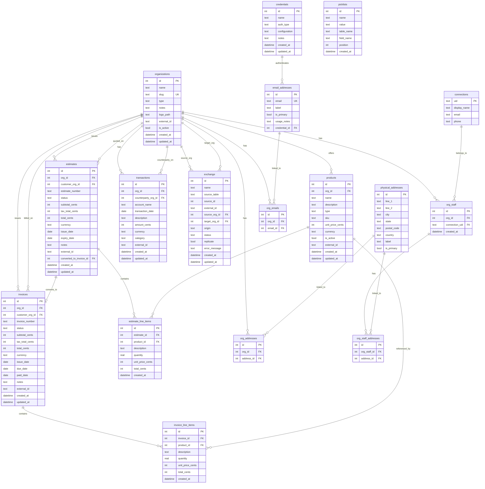

# State: Organization — Foundation & UI (intermediate record)

### 2.3 Schema ERD (v13)

> **Note:** `connections` in this ERD is illustrative — live cache is `tasks.db.connections` (synced from VV; no `email`/`phone` columns; includes `spoken_lang`, `country`, `profile_synced_at`, etc.). Org staff links via `org_staff.connection_uid` → that cache.

Customer/vendor dynamic; Wave maps Customer/Vendor → `organizations` via `external_id`. Full narrative: archive §3.

### 2.4 SQLite standards (summary)

Full text: archive **§9**. Locked rules: cents not float; never SUM across currencies; STRICT; FK ON every connection; WAL at init; busy_timeout 5000; writer `updated_at`; shared `_connect` helper. Historic gap: FK enforcement on older DBs → hub **ORG-D5**. Rounding half-up vs banker's → open for connector/STEWART math.
