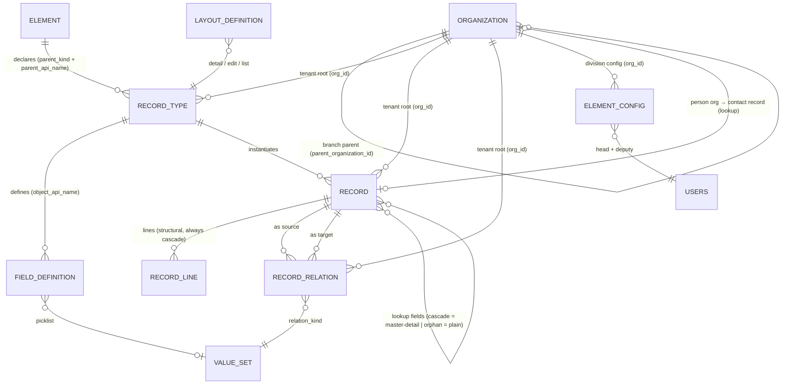

# I5.6.33 — Zone Elements, Record Types & Schema ERD (rev D)

> Owner: Versa (COA) | Product: Mission Control (project #26) | Game #109
> Task: #241 | Status: REDRAFT for Stephen review — supersedes rev C (d1daa1d, 2026-08-31)
> Date: 2026-08-31 | Branch: beta | Base: 7cc408f (#218 Gate 2 PASS)
> Review basis: Stephen's 5-message feedback (2026-08-31 ~05:21) + inline doc comment + organizing-board context (docs/design/org_board/)

---

## 1. What changed since rev C

Stephen's rev D feedback (5 messages, 2026-08-31) restructures the organization zone around the
**organizing board** pattern (7 divisions × 3 departments — see docs/design/org_board/, used as
the design source; cherry-picked, not replicated verbatim) and redefines how the collaboration
zone is modeled:

1. **Faculties → Divisions.** All 7 organization-zone elements are renamed divisions (Stephen's
   inline comment). Each division's configuration holds the **appointed staff member in charge**
   and their **deputy** (§2.6, §4.5).
2. **Person organizations + collaboration zone as organization types.** An organization is either
   a **person organization** (flag) or a legal entity. Vendor / Customer / Partner / Branch are
   **organization types**, not record types — the collaboration zone is a **rendering** of those
   organization types (§2.7, §3). Branch = an organization whose `parent_organization_id` points
   at a parent organization. The default organization filters collaboration entries.
3. **Contacts centralized under Distribution.** The Public division becomes **Distribution**,
   holding the **contact** record type (renamed from public_contact). Staff-type contacts belong
   to an organization; public-type contacts do not. Person organizations link to contact records
   (§3, §4.2).
4. **Division content updates** (§3): Communications adds **reports** and **staff**; Dissemination
   = **sales** + **promotion & marketing** (publications scratched; campaigns fold under
   promotion & marketing); Treasury = **transactions** (classification: income | disbursement) +
   **records, assets and materiel** (single entry; budget and account scratched); Qualifications
   = **examinations**, **review**, **certifications & awards** (qualification_record removed —
   examination checks quality → pass routes to certifications & awards, issues route to review).
5. **Table formatting:** one row per element throughout (§3); environment's four bundled rows
   broken out; vendor integrations shown under Vendor like every other record type.
6. **Typed vs dynamic (Stephen's invitation, answered):** organizations stay a **typed core
   platform table** — now carrying `is_person`, `org_type`, `parent_organization_id` — because
   tenant identity and org-type integrity must be relational. Zone content stays dynamic records
   (§4, C5).

Rev C's multi-organization pattern (§2.5), senior pattern (§2), locked relations (§6) and
implementation realignment (§7) carry forward except where restated here.

Nothing here changes the UI by itself. This is the data-model contract Horizon 1 persistence implements.

---

## 2. The senior pattern (normative)

### 2.1 Elements are record types; instances are records

Every element that holds content (Policy, Projects, Tasks, Product, Service, …) is a
**record type**. A record type holds **many record instances**. Each instance has:

- its own **header** — the fields defined on the record type (title, scope, owner, dates, …), and
- its own **lines** — repeating child rows grouped per the type's line groups.

Not one header config with lines hanging off it. Division configuration is a separate, settled
concern (§2.6, §4.5) — config is not content.

### 2.2 Lookups between record definitions

Record definitions can **look up to other record definitions**. Two semantics, chosen per lookup:

| Kind | Delete behavior | Use when |
|---|---|---|
| **Master-detail** | Deleting the parent takes its children with it (cascade) | Child cannot exist without parent (contract → vendor organization) |
| **Plain lookup** | Children are orphaned and remain (reference cleared/null) | Reference is optional context (policy → knowledge asset) |

Mechanism: a lookup field on a record definition carries `lookup_object_api_name` (target) plus a
**delete rule** (`cascade` = master-detail, `orphan` = plain lookup). Structural ownership
(record → its lines) is always cascade and is not a lookup — it is built-in.

### 2.3 System types locked; custom types via the same mechanism

- **System record types** come preconfigured and **locked** — they cannot be removed
  (`is_system`, enforced in the Records Editor today at records-editor.tsx:449).
- Users create **custom record types and lookups through the same mechanism** (Records Editor)
  and land them anywhere in the **three-zone structure** (Organization / Collaboration /
  Environment — three zones only, for now).

### 2.4 Label rule and the api_name namespace prefix

A record type's **label must be unique within its parent element** but may be **reused across
elements** (two elements can each have a "Contacts" type). `api_name` remains **globally
unique** — that is why seeded types carry a zone/element prefix (`production_product`,
`executive_policy`): the prefix is the namespace that guarantees global uniqueness while labels
stay short and per-element. UI displays labels, never api_names. With contacts now centralized
under Distribution and reusable everywhere, this convention matters more, not less. (Stephen
asked for the reason — this is it; dropping the prefix would force suffixes or a namespace
column instead. Confirm point C8 if a different convention is preferred.)

### 2.5 Multi-organization pattern (LOCKED, 2026-08-31)

- **Multiple organizations** are definable in the system.
- The logged-in user selects a **default organization** (a user-level setting).
- **Every new record auto-presets its `org_id` from the user's default organization** at creation.
  The field is **user-changeable per record** wherever multiple organizations exist.
- **All data relates to organization records** — organization is the tenant root every content
  record hangs from (§4.2, §5).
- The default organization also **filters the collaboration zone** entries (§2.7).

Implementation notes:
- `record_type.org_id` and `record.org_id` are the concrete carriers (§4.2).
- Catalog tables that already carry `org_id` (value_set, field_definition, layout_definition)
  keep it — same pattern, no change.
- The default-organization selection is a **user preference** (users table or user_settings),
  not a record-type concern.
- Auto-preset is **creation-time behavior** in the Records Editor / API layer: prefill `org_id`
  from the user default; the field renders editable (dropdown of organizations) when the user
  has more than one organization available, read-only when only one exists.

### 2.6 Divisions and division configuration (Stephen's inline comment, addressed)

- The 7 organization-zone elements are **divisions**: Executive, Communications, Dissemination,
  Treasury, Production, Qualifications, Distribution (organizing-board pattern).
- Each division's singleton configuration (element_config, §4.5) holds the **appointed staff
  member in charge of the division** and their **deputy** — user lookups, set per division.
- "Faculty" is retired as a term; parent_kind value `faculty` renames to `division`.

### 2.7 Person organizations and the collaboration zone (NEW, locked direction)

- An organization is a **person organization** (`is_person = true`) or a legal entity —
  "either it's a person organization or not", like Salesforce person accounts but named
  organizations. Legal-entity subtypes come later; the flag starts binary.
- **Vendor, Customer, Partner, Branch are organization types** (`org_type`), not record types.
  The **collaboration zone is a rendering** of organizations by type in those four lists.
- **Branch** = an organization with `parent_organization_id` pointing at its parent organization
  (that parent pointer is what makes it a branch).
- **Contacts live under Distribution** (one contact record type). Organizations have their own
  contact records (organization ↔ contact links). A **person organization** can hold a lookup to
  its contact record. Staff-type contacts fall under an organization; public-type contacts do not.
- Party line-groups from rev C (contracts, integrations, orders, agreements, investments) become
  **record types that look up to the organization**; their zone landing is revisited with the
  cross-element matrix (held, §8).

---

## 3. Locked element content (rev D — one row per element)

All decisions below are locked from Stephen's 2026-08-31 rev D feedback. Element content = the
element's record types. "Seeded" = already seeded by #218 on beta (7cc408f).

| Zone | Element (division) | Record types (system, locked) | Structure | Notes |
|---|---|---|---|---|
| Org | Executive | executive_policy *(seeded)* | header_lines | Fields §3.1; one-to-many to all 4 parties + 4 env nodes |
| Org | Communications | communication_message *(new)*, communication_report *(new)*, communication_staff *(new)* | list | Messages typed via `message_type` value set; reports; staff |
| Org | Dissemination | dissemination_sales *(new)*, dissemination_promotion_marketing *(new)* | list | Publications scratched; campaigns fold under promotion & marketing |
| Org | Treasury | treasury_transaction *(new)*, treasury_records_assets_materiel *(new)* | list | Transactions classified income \| disbursement; single RAM entry; budget + account scratched |
| Org | Production | production_product *(seeded)*, production_service *(seeded)* | header_lines ⚠ | Referenced by quotes, invoices, promotion & marketing (lookups) |
| Org | Qualifications | qualification_examination *(new)*, qualification_review *(new)*, qualification_certifications_awards *(new)* | list | Exam → pass: certifications & awards; issues: review |
| Org | Distribution | contact *(new)* | list | Renamed from Public; staff-type contacts belong to an organization, public-type do not; person orgs link to contact records |
| Collab | Vendor | — | rendering | Organization type `vendor` — rendered from organizations (§2.7) |
| Collab | Vendor ▸ Integrations | vendor_integration *(seeded)* | list | Shown under Vendor like every other record type; stays a record type related to vendor, or becomes a lines group — §7.6 / C3 |
| Collab | Customer | — | rendering | Organization type `customer` |
| Collab | Partner | — | rendering | Organization type `partner` |
| Collab | Branch | — | rendering | Organization type `branch` = parent_organization_id set |
| Env | Locations | location *(new)* | list | Environment nodes stay lists (locked) |
| Env | Events | event *(new)* | list | |
| Env | Knowledge | knowledge *(new)* | list | |
| Env | Schedules | schedule *(new)* | list | |

⚠ = structure change required from the current #218 seed (`list` → `header_lines`), because each
instance now carries its own header + lines. See §7.

### 3.1 Policy (executive_policy) — header fields

Per Stephen (rev C review): created / last-modified / review / effective datetimes + optional
new-version checkbox.

- `created_at`, `updated_at` — system timestamps on every record (no per-type definition needed)
- `effective_date` (datetime), `review_date` (datetime)
- `new_version` (boolean, optional checkbox)
- Plus rev A baseline: name, status, scope (picklist), owner (lookup → users), summary
- Lines: policy lines (per #218 seed — zone_role=list, show_in_column)

Interpretation flag: if the new-version checkbox is meant to **link a policy to its predecessor**,
we add an optional `supersedes` lookup (plain lookup, orphan) revealed when the checkbox is set.
Confirm with your next review (C4).

### 3.2 Executive one-to-many (locked)

Policy, Projects and Tasks each relate **one-to-many to all four parties AND all four environment
nodes**. Implemented via `record_relations` (§4.4): from an executive record, multiple party and
environment relations; navigation presented both ways on detail pages.

Note (rev D): "parties" in this table now means **organizations of type vendor / customer /
partner / branch** (§2.7). The relation targets organizations, not party record instances.

---

### 3.3 Treasury transactions (NEW)

- `treasury_transaction` carries a **classification** picklist: **income | disbursement**
  (value set `treasury_transaction_classification`).
- **Records, Assets and Materiel** (RAM) is a **single record type** — not three — covering the
  division's records, assets and materiel entries (spelling per Stephen: Records, Assets and Materiel).
- Budget and account are scratched (rev C rows superseded).

---

## 4. Data model (Horizon 1)

### 4.1 Already persisted (catalog tables, live today)

`value_set`, `value_set_item`, `field_definition`, `layout_definition` — as coded in
src/lib/db/schema.ts. The 26-field catalog seed (#218) wires the 6 seeded types to the 7 locked
value sets.

### 4.2 New record tables (Horizon 1 scope)

    record_type (
      id, org_id → organizations.id,
      api_name  UNIQUE,          -- globally unique
      label,
      parent_kind,               -- division | collaboration | environment | baked_in
      parent_api_name,           -- element api_name — three-zone collaboration landing
      structure,                 -- list | header_lines
      is_system BOOLEAN,         -- locked when true
      created_at, updated_at
    )

    record (
      id, org_id → organizations.id,
      record_type_id → record_type.id,
      header JSONB,              -- field values per the type's field definitions
      created_by → users.id,
      created_at, updated_at
    )

    record_line (
      id, record_id → record.id (cascade),
      line_group,                -- per the type's line groups
      position,
      data JSONB,
      created_at, updated_at
    )

    record_relations (
      id, org_id → organizations.id,
      source_record_id → record.id,
      target_record_id → record.id,
      relation_kind → value_set, -- locked relation kinds (§6)
      created_at, updated_at
    )

    lookup_field (               -- on a record definition (field_definition extension)
      lookup_object_api_name,    -- target record type
      lookup_delete_rule         -- cascade (master-detail) | orphan (plain lookup)
    )

### 4.3 Organizations (typed core platform table — extended, rev D)

    organizations (
      id,
      name,
      is_person BOOLEAN,               -- person organization or not (§2.7)
      org_type,                        -- vendor | customer | partner | branch | internal (value set)
      parent_organization_id → organizations.id,  -- set ⇒ branch (§2.7)
      created_at, updated_at
    )

- Stays **typed** (C5 reading): tenant identity, org-type integrity and the parent pointer are
  relational concerns.
- The collaboration zone renders `organizations WHERE org_type = <type>` filtered by the user's
  default organization (§2.5).
- Person organizations may hold a lookup to their contact record (Distribution contacts, §3).

### 4.4 record_relations (unchanged from rev C)

Carries the locked relation kinds (§6). Executive one-to-many to parties + environment nodes,
dissemination relations, qualification relations, product/service references all land here.

### 4.5 element_config (division configuration)

    element_config (
      id, org_id → organizations.id,
      element_api_name,          -- the division (executive, communications, …)
      head_user_id → users.id,   -- appointed staff member in charge of the division
      deputy_user_id → users.id, -- deputy in charge
      config JSONB,              -- division-specific configuration
      created_at, updated_at
    )

Singleton per division (unique on org_id + element_api_name). Replaces the rev-C "faculty
Configuration forms" wording; same mechanism, division terminology, head + deputy fields added
per Stephen's inline comment.

---

## 5. ERD (Mermaid, rev D)

Notes:
- ORGANIZATION is the tenant root AND the collaboration-zone source: org_type renders
  vendor / customer / partner / branch; parent_organization_id marks branches (§2.7).
- ELEMENT is polymorphic: division | collaboration | environment | baked_in (three-zone landing).
- RECORD parent is the record TYPE (canonical); no per-instance parent in Horizon 1.
- Core platform tables (organizations, departments, users) stay typed per locked philosophy —
  C5 reading, now extended with is_person / org_type / parent_organization_id.

---

## 6. Locked relation decisions (from review — not the held matrix)

| Relation | Decision |
|---|---|
| Executive Policy / Projects / Tasks | One-to-many to all 4 parties (org types) AND all 4 environment nodes |
| Dissemination (sales, promotion & marketing) | Relatable to parties + environment nodes |
| Qualifications (exams / review / certifications & awards) | Relate to all organization-zone children |
| Production product & service | Referenced by quotes, invoices, promotion & marketing (lookups into product/service) |
| Treasury transactions | Classification: income \| disbursement |
| Branch | parent_organization_id set (organization type, not record type) |
| Environment nodes | Stay lists; relate cross-element (matrix held) |
| All data | Relates to organization records (§2.5) |

The full 40-hint cross-element matrix remains **HELD by Stephen** — it returns for review after
these changes settle.

---

## 7. Implementation realignment (current code → target)

1. **Done (#218, beta 7cc408f):** 6 system record types seeded (executive_policy header_lines;
   executive_project, executive_task, production_product, production_service, vendor_integration
   as list) + 26-field catalog seed wired to 7 value sets; baked listing tabs wired to system
   types; sampleRows mocks removed from the 6 baked children.
2. **Structure corrections (⚠ in §3):** executive_project, executive_task, production_product,
   production_service move `list` → `header_lines` (each instance = header + lines). Lines groups
   per §3 table (rev A carry-over, now per-instance). executive_policy already header_lines.
3. **Detail views:** tabs render **list → detail** — each instance opens its own header + lines.
   Applied to Projects, Tasks, Product, Service, Integrations alike.
4. **New system types seed (§3 "new" rows):** communication_message (+ message_type value set),
   communication_report, communication_staff, dissemination_sales,
   dissemination_promotion_marketing, treasury_transaction (+ income/disbursement value set),
   treasury_records_assets_materiel, qualification_examination, qualification_review,
   qualification_certifications_awards, contact, location, event, knowledge, schedule.
5. **Organizations extension (§4.3):** add is_person, org_type (value set:
   vendor/customer/partner/branch/internal), parent_organization_id. Collaboration zone pages
   render organizations by type filtered by the default organization — replacing the rev-C plan
   of seeding vendor/customer/partner/branch record types.
6. **Residual (named in #218 Gate 1, Amendment 1):** the 8 parent tabs (vendor, customer, partner,
   branch, locations, events, knowledge, schedules) still render sampleRows mocks — vendor /
   customer / partner / branch now wire to organizations-by-type; locations / events / knowledge /
   schedules wire to the new system types.
7. **vendor_integration:** stays a record type related to vendor (lookup), or becomes a lines
   group on vendor — see confirm point C3 (§9).
8. **Organization auto-preset:** Records Editor / API creation paths prefill `org_id` from the
   logged-in user's default organization; editable per record where multiple organizations exist
   (§2.5). Single-org users see it read-only.
9. **Division configuration UI:** element_config singleton per division with head + deputy user
   lookups (§4.5).

---

## 8. Held by Stephen (not decided here)

- Cross-element relatability matrix (rev A §5, 40 hints) — returns after these changes settle.
- Purchase orders under Treasury — Stephen's call later.
- Party line-groups' new zone landing (contracts, integrations, orders, agreements, investments
  as record types looking up to organizations) — revisited with the matrix (§2.7).
- Anything beyond the three-zone structure.

---

## 9. Confirm points (only genuine ambiguities — everything else is locked)

- **C1 — Party instances as records:** superseded by rev D §2.7 — parties are organizations of
  type vendor/customer/partner/branch (typed table), not record instances. The typed `parties`
  table serves legacy surfaces until cutover. Confirm the retirement reading.
- **C2 — Lookup delete-rule default:** `orphan` (plain lookup) as default, `cascade`
  (master-detail) opt-in per field. Confirm.
- **C3 — vendor_integration:** stays a record type related to vendor (lookup), or becomes a
  lines group on vendor instances. Confirm.
- **C4 — Policy new-version checkbox:** if it should link the new version to its predecessor, we
  add an optional `supersedes` lookup (plain lookup). Confirm intent.
- **C5 — Organizations as core system table (tenant root):** recommended reading — `organizations`
  stays a typed core platform table, now extended with is_person / org_type /
  parent_organization_id (§4.3). Alternative: model organizations as record types. Confirm.
- **C6 — Collaboration zone rendering mechanics:** vendor/customer/partner/branch lists render
  `organizations WHERE org_type = <type>` filtered by the default organization. Confirm the
  default-org filter behavior (hide other orgs' entries vs read-only view).
- **C7 — Dissemination campaigns:** campaigns fold under promotion & marketing as a record type
  or lines group — rev C's standalone dissemination_campaign is retired. Confirm.
- **C8 — api_name prefix convention:** keep zone/element prefixes on api_names (labels stay
  short; §2.4 explains why). Confirm, or propose the alternative you prefer.

---

## 10. Next steps

1. Stephen reviews §2.6–§2.7, §3 and §4.3 and ticks confirm points C1–C8.
2. Lock built-in division definitions + new system types as Horizon 1 seed data.
3. Horizon 1 proceeds: record_type, record, record_line, record_relations tables +
   lookup_delete_rule + element_config (head + deputy) + organizations extension
   (is_person / org_type / parent_organization_id) + organization auto-preset + full system-type seed.
4. Web-dev resumes dynamic-records slices (#185) on the locked schema; 8 parent tabs wiring
   follows as the next zone-pages slice (4 party tabs → organizations-by-type).
