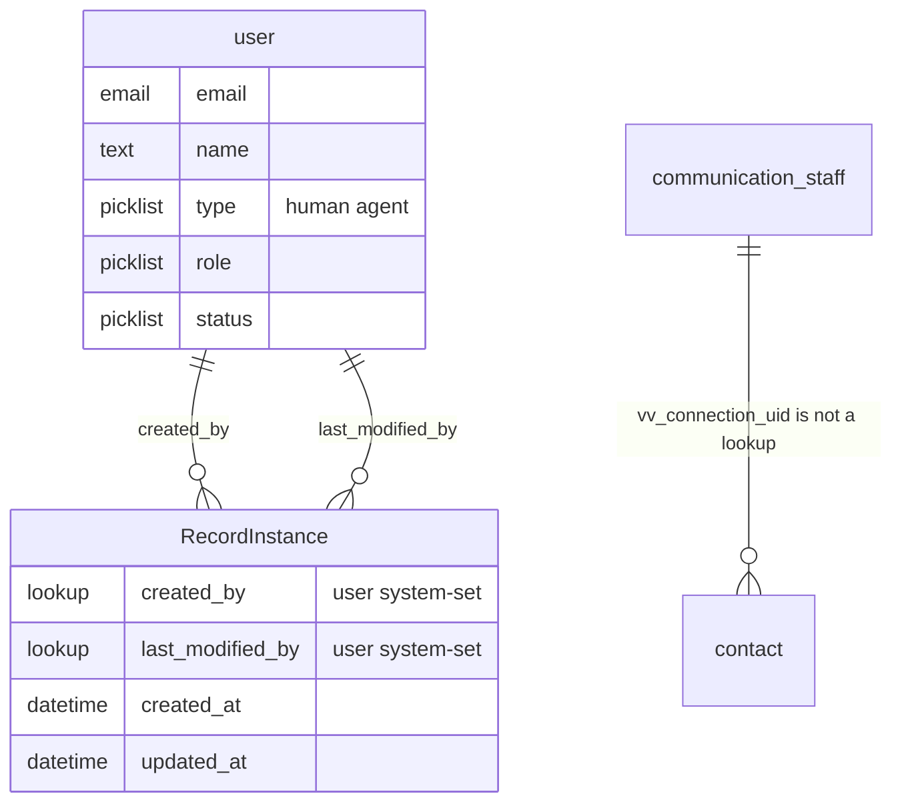
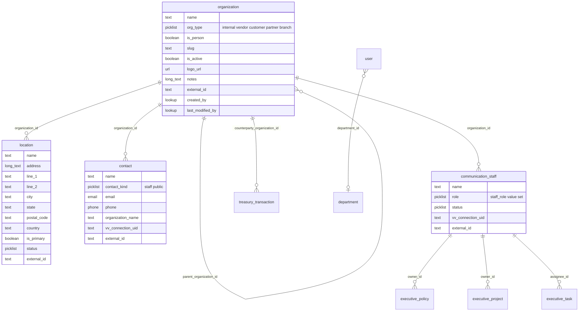
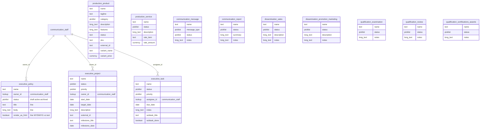
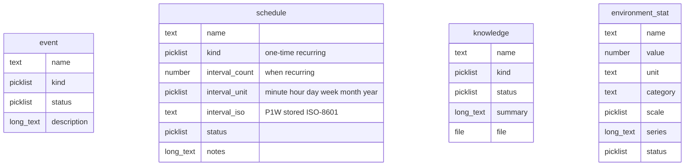
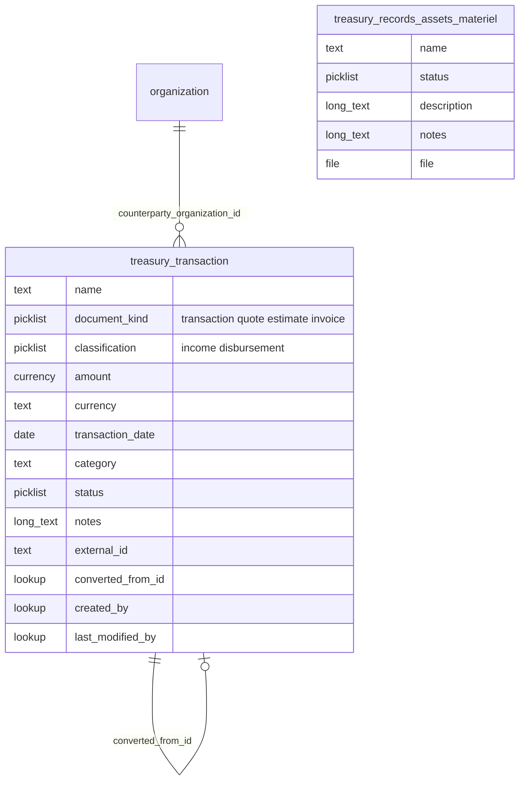
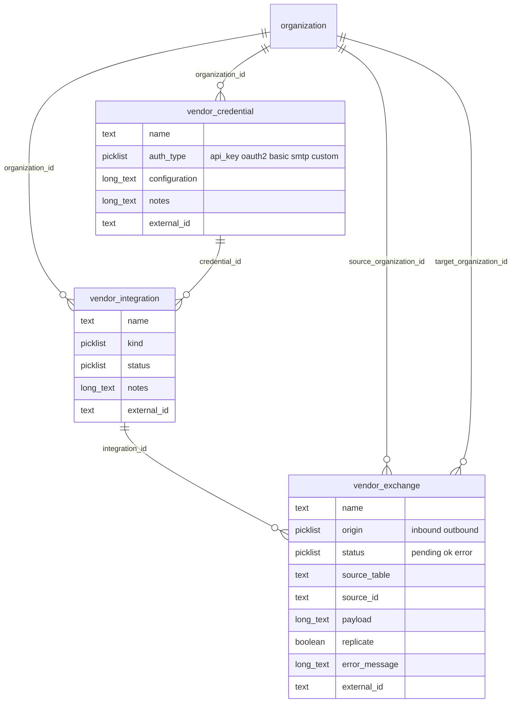
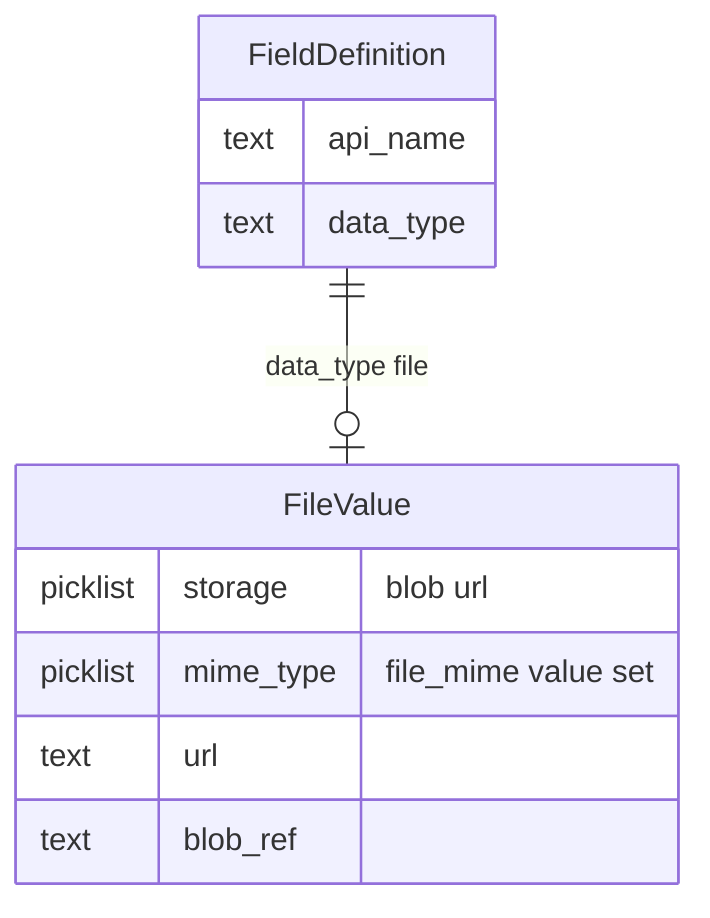

# Mission Control — record-type ERD (inventory review)

**Date:** 2026-09-05  
**Source:** inventory as coded + Stephen locks (including 17:36 EDT feedback).  
**Sign-off:** this file. Seed pack **0.7.133** matches this picture. `migrate_agi_org` still waits.

Solid names = in the catalog today. Fields listed here are the seeded set.

Collaboration Vendor path: **Collaboration / Vendor / {Credentials | Integrations | Exchange}**.

Preview this markdown so the mermaid renders.

## Faculty (definition)

**Faculty** here is not a university. It is an **internal function of the Organization** — a capacity the business uses to operate — as opposed to a **collaboration party** (vendor, customer, partner, branch) or **environment** (locations, events, knowledge, schedules).

The Organization ring is the set of faculties: Executive, Communications, Dissemination, Treasury, Production, Qualification, Distribution (Public). Record types that hang under those tabs use `parent_kind: faculty` in code. A Service is “a faculty through which results are achieved” (e.g. bookkeeping): the same word, a function, not a person.

Operators see the tab names (Executive, Production, …). `faculty` is the Records Editor parent-kind token. We can rename that token to `organization` later if you want the word gone from the editor.

---

## One set of names (locked 2026-09-05)

**Yes — one business object each.** Keep the zone record types. Do **not** keep a second set called `project`, `task`, `product`, or `service`.

| Canonical (keep) | Fold into it, then retire the name |
|------------------|------------------------------------|
| `executive_project` | typed core `project` (`/api/projects`, `/projects`) |
| `executive_task` | typed core `task` (`/api/tasks`, `/tasks`) |
| `production_product` | typed core `product` (`/api/public/products`, `/products`) |
| `production_service` | (no typed-core twin) |
| `organization` | already one table |

Take useful fields from the old cores (priority, dates, tagline, …) onto the canonical types. Person fields stay **staff** lookups. Anything still using the short names is a **rename/refactor**, not a second schema. `organization` and `user` stay typed cores; they are not in that duplicate set.

---

## Platform fields on every record type

`created_by` / `last_modified_by` are system-maintained lookups to **user** (the signed-in operator or agent account). They are not staff lookups.

`vv_connection_uid` is **not** on every table. It is a VersaVoice uid **text** on staff and contacts only — a pointer into the host Connections cache, not a local FK.

---

## 1. Spine — Primary Org, parties, staff

Person fields on the Org schema (owner, assignee, and any other “who”) look up **`communication_staff`**. Login identity stays on **user**.

---

## 2. Faculty record types

Policy: `scope` and `summary` removed. Lines are `title` + `body`. `render_as_html` on the line chooses a WYSIWYG (HTML) editor vs plain text for that `body`. Status is a picklist (`draft | active | archived`).

---

## 3. Environment

### Schedule interval (recommendation)

Postgres `INTERVAL` is a good **storage** type on a typed table. It is a poor **widget**: strings like `2 days 03:00:00` are unfriendly, and fixture JSON cannot native-interval anyway.

Proposed catalog shape:

- Widget: number + unit (`every [2] [weeks]`), shown when `kind=recurring`.
- Stored as ISO 8601 duration in instance JSON (`P2W`, `PT15M`) — portable, standard, queryable.
- Optional later: a generated Postgres `interval` column parsed from `interval_iso` for SQL date math.

That is enough for “every N minutes/hours/days/weeks/months/years”. Calendar RRULE (“second Tuesday”) is a separate later field if you need it; do not overload interval for that.

---

## 4. Treasury — this is the transaction table

`treasury_transaction` **is** Mission Control’s transaction table (AGi `transactions` + quote/estimate/invoice as kinds).

---

## 5. Collaboration / Vendor / {sub-tab}

Sub-tabs under Vendor: **Credentials**, **Integrations**, **Exchange**.

Today Integrations are org-attached lines. After seed they become a record type so the other two can look them up.

---

## 6. File field type

---

## 7. Fold / rename (not a second ERD)

When seeding, retire catalog objects `project`, `task`, `product`. Point `/api/projects`, `/projects`, public product listings, and nav at `executive_project` / `executive_task` / `production_product`. Drop `task_count` (derive from related tasks). Drop `owner_name` / `assignee_name` (staff lookups).

`user`, `organization`, and `department` stay. They were never the duplicate set.

---

## Catalog parents (containers)

Faculty: `executive`, `communications`, `dissemination`, `production`, `qualification`, `treasury`, `public`.  
Collaboration: `vendor`, `customer`, `partner`, `branch`.
