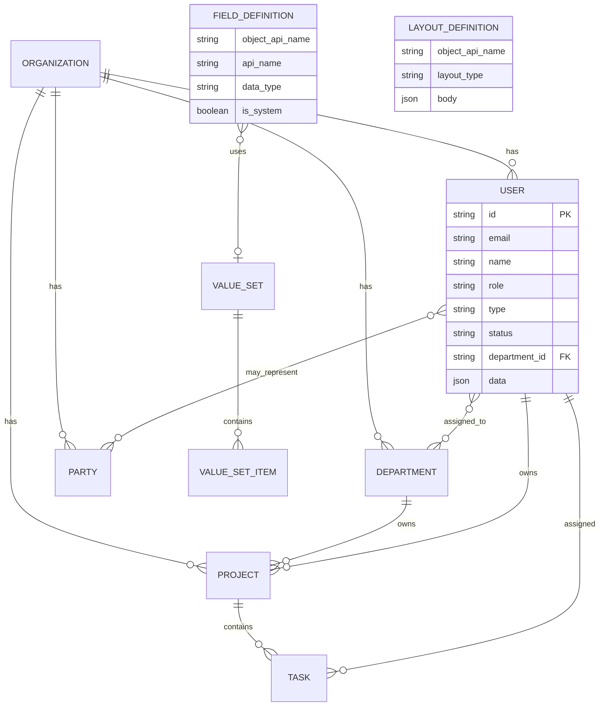

# Baseline ERD — User pilot + extensibility stubs (I5.6.23)

**Status:** Draft for Stephen lock — 2026-07-20  
**Project:** versa-admin-system (#26) · Game #109  
**Builds on:** `MISSION_CONTROL_ZONE_ERD_I5.6.md`, `MISSION_CONTROL_ERD_KEYSTONE.md`  
**Author:** Versa (COA)  
**Decisions locked (Stephen 2026-07-20):**
- Pilot object: **User**
- Per-object **layout manager**
- Instance / flexible data: **JSON in the database** (no live DDL per custom field)
- **Baseline ERD first**; custom-field and layout work may be stubbed but not built out until base is signed

---

## 1. Storage philosophy

| Layer | What lives here | Why |
|-------|-----------------|-----|
| **Core columns** | Stable, query/index/FK fields | Auth, joins, lists, uniqueness |
| **`data` JSON** | Flexible / custom attributes on the row | Avoid schema churn; promote later if needed |
| **Catalog tables** | Field definitions, layouts, value sets | Shared metadata — not buried only inside each record |

**Rule:** Record JSON stores *values* (including picklist api codes). Catalog stores *definitions* (labels, allowed values, layout).

---

## 2. Baseline entities (core)

### 2.1 User (pilot)

| Column | Type | Notes |
|--------|------|--------|
| `id` | string (PK) | Stable id |
| `email` | string (unique) | Login / contact |
| `name` | string | Display name |
| `role` | enum/string | `admin` \| `member` (core RBAC) |
| `type` | enum/string | `human` \| `agent` |
| `status` | enum/string | `active` \| `inactive` — **prefer value_set** long-term; core enum OK for v1 |
| `department_id` | string (FK, nullable) | Optional single primary dept; M:N via join if needed |
| `created_at` / `updated_at` | datetime | Audit |
| `data` | JSON | Bio, phone, timezone, title, custom fields, etc. |

**Session** (derived, not a durable entity): `userId`, `name`, `email`, `role`, `type` — as today.

### 2.2 Organization (tenant root)

| Column | Type | Notes |
|--------|------|--------|
| `id` | string (PK) | |
| `name` | string | |
| `data` | JSON | Slogan, contact, address, branding… |

### 2.3 Department

| Column | Type | Notes |
|--------|------|--------|
| `id` | string (PK) | |
| `organization_id` | FK | |
| `code` | string | executive, communications, … |
| `name` | string | |
| `data` | JSON | |

### 2.4 Project / Task (Executive spine — core FKs)

**Project:** `id`, `organization_id`, `name`, `status`, `owner_user_id`, `priority`, dates, `data` JSON  
**Task:** `id`, `project_id`, `title`, `status`, `priority`, `assignee_user_id`, `due_date`, `data` JSON  

### 2.5 Party (Collaboration supertype)

**Party:** `id`, `organization_id`, `party_kind` (vendor|customer|partner|branch), `name`, `status`, `data` JSON  
No party↔party edges (I5.6.4).

### 2.6 Environment mesh

**Location / Event / KnowledgeAsset / Schedule** — each: `id`, `organization_id`, core label/title/timestamps, `data` JSON  
M:N via junction tables (or JSON id arrays only as interim — prefer junctions for mesh).

### 2.7 Product / Service / Integration / Policy

Core id + org (or parent) FKs + name/status + `data` JSON. Align with zone ERD ownership (Production, Vendor→Integration, Executive→Policy).

---

## 3. Extensibility stubs (not built until baseline locked)

### 3.1 value_set / value_set_item (global picklists)

```
value_set
  id, api_name (unique), label, description

value_set_item
  id, value_set_id, api_value, label, sort_order, active
```

- Field defs reference `value_set.api_name` or id.  
- Record JSON stores `api_value` or `api_value[]` only.  
- UI resolves labels from catalog.  
- “Local” picklist = a value_set used by one field.

### 3.2 field_definition

```
field_definition
  id
  object_api_name          -- e.g. "user", "project"
  api_name                 -- e.g. "timezone"
  label
  data_type                -- text | long_text | number | boolean | date | datetime
                           -- | picklist | multipicklist | lookup | email | url | phone | currency
  is_system                -- true = baseline/core; not deletable
  is_required
  default_value            -- JSON scalar
  value_set_api_name       -- nullable; for picklists
  lookup_object_api_name   -- nullable; for lookup
  sort_order
  active
  -- optional: validation JSON, help_text
```

System fields mirror core columns; custom fields are read/written via `data` JSON key = `api_name`.

### 3.3 layout_definition (per-object layout manager)

```
layout_definition
  id
  object_api_name
  api_name                 -- e.g. "user_default", "user_admin_edit"
  label
  layout_type              -- detail | edit | list | create
  version
  body JSON                -- sections + field refs + widgets
  is_default
```

**Example `body` sketch:**

```json
{
  "sections": [
    {
      "id": "identity",
      "label": "Identity",
      "fields": [
        { "api_name": "name", "read_only": false },
        { "api_name": "email", "read_only": true },
        { "api_name": "role" },
        { "api_name": "status" }
      ]
    },
    {
      "id": "profile",
      "label": "Profile",
      "fields": [
        { "api_name": "bio" },
        { "api_name": "timezone" }
      ]
    }
  ]
}
```

One layout manager UX per object; layouts are data, not hard-coded React forms long-term.

---

## 4. Mermaid — baseline + stubs



---

## 5. User pilot — system fields vs `data` JSON

| api_name | System column? | In `data`? | Notes |
|----------|----------------|------------|--------|
| id, email, name, role, type, status | yes | no (mirror optional) | Auth + lists |
| department_id | yes (or M:N join) | no | |
| bio | no | yes | exists on fixture User today |
| phone, title, timezone, avatar_url | no | yes | natural customs |
| future customs | no | yes | via field_definition |

**Picklist examples for pilot:**
- `user_status` value_set → status (or keep core enum and only use value_set for new fields)
- `user_timezone` value_set → `data.timezone`

---

## 6. Build sequence (agreed)

| Step | Deliverable | Gate |
|------|-------------|------|
| **A** | This baseline ERD signed | Stephen lock |
| **B** | Stub catalog: value_set, field_definition, layout_definition (fixture or tables) | After A |
| **C** | User pilot: core + `data` JSON + layout-driven view/edit + 1–2 picklists | After B |
| **D** | Roll pattern to Project/Task/Product/… | After C |

**Explicit non-goals until A is locked:** custom-field admin UI polish, dynamic DDL, multi-object layout builders.

---

## 7. Alignment with existing zone ERD

- Zone membership and relationship policy unchanged (`MISSION_CONTROL_ZONE_ERD_I5.6.md`).
- This doc adds **persistence shape** (core + JSON) and **metadata stubs** for Salesforce-like extension.
- Header username → `/users` remains admin path until User layout pilot ships a true profile surface.

---

## 8. Open items (only if Stephen wants to tweak before lock)

1. Single `department_id` on User vs M:N `user_department` only?  
2. Promote `status` / `role` to value_sets in v1 or keep native enums?  
3. Fixture/JSON files on beta first vs Postgres JSONB tables immediately?  
4. Profile route: `/users` list vs `/users/[id]` or `/profile` for self?

---

## 9. Changelog

| Date | Note |
|------|------|
| 2026-07-20 | Initial draft from Stephen decisions: User pilot, layout manager, JSON-in-DB, baseline-before-customs, value_set hybrid for picklists |
