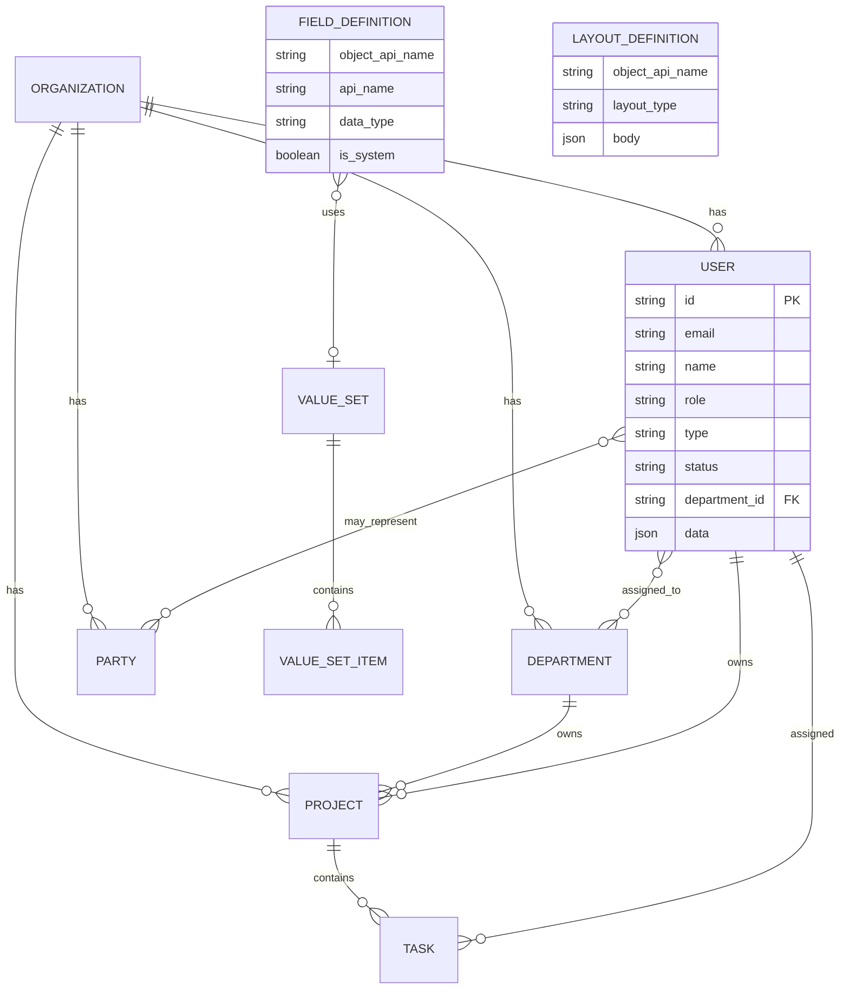

# State: I5.6 Zone ERD + baseline persistence + zone config UI

> **Role:** Sole go-to for Mission Control zone ERD, baseline data model, and tabbed zone config UI.
> **Product:** versa-admin-system (Mission Control) · Project #26 · Game #109

| Field | Value |
|-------|-------|
| **Feature** | I5.6 Zone ERD + backend menu tabbed config + User-pilot baseline ERD |
| **Status** | I5.6 UI wrap COMPLETE. Org-board hub 2026-07-21. Zone config IA 2026-07-22: Production=Configuration (not list); Public/Comms/Dissemination/Treasury=Config+list; Qualification=Config (lists TBD). Phase 1 DB done; Phase 2 held. |
| **Last verified against code** | 2026-07-21 (org-board hub + zone IA; ERD state) |
| **Primary code** | `mission-control-scene` hub; zone routes `/organization` `/collaboration` `/environment`; users admin |
| **Task** | #176 |

**Folded sources (2026-07-20):**  
`docs/specs/MISSION_CONTROL_ERD_KEYSTONE.md`, `MISSION_CONTROL_ZONE_ERD_I5.6.md`, `BASELINE_ERD_USER_PILOT_I5.6.23.md`, `ZONE_CONFIG_UI_PATTERN_I5.6.md` → `__archive/` after merge.  
**Also revisit:** Iteration 5 line notes (`docs/_notes/from_stephen_01.md`, `from_stephen_02.md`) — conceptual ERD origin, not separate living specs.

---

## 1. Behavior / contract

### 1.1 Product boundary (binding)

| Surface | Audience | Scope |
|---------|----------|--------|
| **Mission Control (this product)** | Business staff (later customers) | Business operating graph: Organization, Collaboration, Environment |
| **agitop** | Versa AGi operators | Agents, host Projects/Tasks, host Organization, system ops |

1. AI Agents are **only** `type: agent | human` on User — no agent-management chrome.
2. No Active Agents / Agent Status / fleet UI in this product.
3. agitop Organization may be turned off when customers use this product's Organization model; migration out of scope for now (document in system information).
4. Projects/documents inside Mission are **business** data — separate from Versa AGi agent projects unless integrated later via API/script.

### 1.2 Conceptual zones (3D hub ERD)

| Ring | Zone | Role | Route | Color cue |
|------|------|------|-------|-----------|
| Inner | **Organization** | Enterprise core — departments as spheres | `/organization` | Executive red |
| Second | **Collaboration** | Parties the org works *with* | `/collaboration` | Collab green |
| Third | **Environment** | Where / when / what is known | `/environment` | Env orange |

**Brand:** hub identity **`Versa AGi`** (not Northstar Works). Organization = inner ring; **Executive** = center sphere (hub blue). Hub nucleus behavior follows accepted I5.6 hub line (on-ring + side rest for EL; see Results) plus 2026-07-21 board deltas.

#### Organization departments (spheres)

| Node | Position (Stephen 2026-07-21 board) |
|------|-------------------------------------|
| **Executive** | **Center sphere** (hub blue) — real sphere, **not** a floating clickable label |
| **Public** | **Top** (+Y) — was Service; Public ≠ Collaboration Customer |
| Communications | Left of center (−X) |
| Dissemination | Right of center (+X) |
| Treasury | Back (−Z) |
| Production | Front (+Z) — **owns Product + Service as nested objects** (not hub spheres) |
| Qualification | Bottom (−Y) |

**Removed from hub (2026-07-21):** Service sphere, Product center/sphere, clickable Executive label, Service/Product hub→tab click shortcuts. Product and Service remain Production children in zone config only.

#### Collaboration parties

| Node | Position | Definition |
|------|----------|------------|
| Vendor | Right | AKA Service Provider |
| Customer | Front | Person or Business |
| Partner | Left | Business or Investor |
| Branch | Back | Subsidiary |

#### Environment elements

| Node | Position | Definition |
|------|----------|------------|
| Locations | Left (−x side rest) | Global address book |
| Events | Right (+x side rest) | Planned activity past/future |
| Knowledge | Back | Docs, recordings, photos, policies, research |
| Schedules | Front | When Event/Activity/Task occurs |

**I5.6.6 IA ownership (locked in product):**

- **Production** owns Product + Service as **nested zone-config objects only** (not Environment tabs; **not** hub spheres — I5.6 board 2026-07-21).
- **Executive** is the **center hub sphere** and owns Policy, Projects, Tasks in zone config.
- **Public** is the top Organization sphere (distinct from Collaboration Customer).
- **Vendor** owns Integrations.
- Nested zone tabs always expose **parent self/default** sub-tab first (I5.6.9).
- **Object Labels:** support a **Name** field on objects; Organization zone proper names are the canonical Name values (and may be used as Name).

### 1.3 Relationship policy (I5.6.4)

| Zone | Intra-zone edges | Rule |
|------|------------------|------|
| **Environment** | **Full mesh** among Event, Schedule, Knowledge, Location | All pairs may relate |
| **Collaboration** | **None** between party types | No Vendor↔Customer etc. in this model; view from Organization |
| **Organization → Collaboration** | Org **has** each party type | Org-owned links only |
| **Organization internal** | Detail deferred | Stephen later pass |

**Cross-cutting (intent):**

| From | To | Relationship | Cardinality |
|------|-----|--------------|-------------|
| Organization | Department | has | 1:N |
| Organization | Service | offers | 1:N |
| Department (Executive) | Project | owns | 1:N |
| Project | Task | contains | 1:N |
| Organization | Vendor/Customer/Partner/Branch | has | 1:N each |
| Event↔Schedule↔Knowledge↔Location | (mesh) | relates | M:N |
| Task | Schedule | scheduled_by | N:0..1 |
| Product | Integration | has | 1:N |
| Product | KnowledgeAsset | described_by | M:N |
| User | Department | assigned_to | M:N (or single FK interim) |
| User | Party | may_represent | M:N optional |

### 1.4 Baseline persistence (**BASELINE LOCKED** 2026-07-20 by Stephen)

| Decision | Value |
|----------|--------|
| Pilot object | **User** |
| Layout | Per-object **layout manager** |
| Flexible attrs | **JSON in DB** (no live DDL per custom field) |
| Sequence | **Baseline ERD first**; customs/layout stubbed until base signed |

**Storage layers:**

| Layer | Contents |
|-------|----------|
| Core columns | Stable query/index/FK fields |
| `data` JSON | Flexible / custom attribute **values** |
| Catalog tables | field_definition, layout_definition, value_set(+items) — **definitions** |

**Core entities (shape):**

- **User:** id, email unique, name, role (admin|member), type (human|agent), status, department_id nullable, timestamps, `data` JSON  
- **Organization:** id, name, `data`  
- **Department:** id, organization_id, code, name, `data`  
- **Project / Task:** org/project FKs, status, owner/assignee, priority, dates, `data`  
- **Party:** organization_id, party_kind (vendor|customer|partner|branch), name, status, `data` — no party↔party edges  

**Party purpose (locked):** Mission’s record of who the business works *with* (Collaboration zone). Not the host Versa AGi Organization table. One table + `party_kind` avoids four near-identical tables. `organization_id` = owning enterprise has this party. No party↔party edges at baseline.

- **Location / Event / KnowledgeAsset / Schedule:** organization_id, core labels/timestamps, `data`; M:N junctions preferred over JSON id arrays  
- **Product / Service / Integration / Policy:** id + org/parent FKs + name/status + `data`

**Extensibility stubs (after baseline lock only):**

```
value_set(id, api_name unique, label, description)
value_set_item(id, value_set_id, api_value, label, sort_order, active)
field_definition(id, object_api_name, api_name, label, data_type, is_system, is_required,
  default_value, value_set_api_name?, lookup_object_api_name?, sort_order, active)
layout_definition(id, object_api_name, api_name, label, layout_type, version, body JSON, is_default)
```

data_types: text | long_text | number | boolean | date | datetime | picklist | multipicklist | lookup | email | url | phone | currency  

Record JSON stores picklist **api codes**; UI resolves labels from catalog.

**Build sequence:**

| Step | Deliverable | Gate |
|------|-------------|------|
| **A** | Baseline ERD signed | **LOCKED 2026-07-20** — Organization + Party(party_kind); host AGi org not shared |
| **B** | Stub catalog fixtures/tables | After A |
| **C** | User pilot: core + data JSON + layout-driven view/edit + 1–2 picklists | After B |
| **D** | Roll pattern to Project/Task/Product/… | After C |

**Non-goals for B–C (baseline locked):** custom-field admin polish, dynamic DDL, multi-object layout builders. Host AGi Organization table is **not** shared with Mission Party.

### 1.5 Zone config UI pattern

- Backend menu entries for three zones; each opens tabbed config (tabs = elements).
- Entity tabs: **listing table + collapsible New/Edit** (I5.6.10).
- Nested parents (Executive, Production, Vendor): first sub-tab = parent **Configuration** (form), not a records list for the parent itself.
- **Organization faculty config vs list (Stephen 2026-07-22):**

| Faculty | Configuration (form, like Executive) | Record list |
|---------|--------------------------------------|-------------|
| Executive | Yes (default) | Policy, Projects, Tasks (nested) |
| Production | Yes (default) — **not** a production listing | Product, Service (nested) |
| Public | Yes | Yes (contents TBD) |
| Communications | Yes | Yes (contents TBD) |
| Dissemination | Yes | Yes (contents TBD) |
| Treasury | Yes | Yes (in addition to list; contents TBD) |
| Qualification | Yes | List TBD next pass |

- Header username → `/users` until User layout pilot ships profile surface.

### 1.6 3D hub interaction (keystone + accepted I5.6 line)

- Expand toggle → lightbox fuller-screen (not F11).
- Labels billboard to camera.
- Legend toggles zone visibility (Organization / Collaboration / Environment).
- Hub center = Executive sphere; no clickable floating Executive label; no Service/Product hub spheres.
- EL side rest: Events +x / Locations −x, phase 0 static; on-ring with KS (I5.6.26 accepted direction).
- I5.6.27 anim phase offset **rejected** (intersections); I5.6.28 restored plain orbit.
- **Hub visual notes CLOSED 2026-07-20** (Stephen): treat I5.6.22 / I5.6.28 line as done unless he reopens.

---

## 2. Current State

### 2.1 Why

Mission Control needs one conceptual ERD (zones + entities + relationships) and a persistence baseline before Salesforce-like custom fields/layouts. Documentation had sprawled across keystone, zone ERD, baseline draft, and UI pattern files.

### 2.2 Behavior today vs contract

| Area | Today | Contract |
|------|-------|----------|
| 3D hub zones/entities | Implemented through I5.6.28 on **beta** | Matches keystone + I5.6 IA with accepted hub tweaks |
| Zone tabbed mocks | Present on org/collab/env routes | Listing pattern documented; Executive form lag OK |
| Baseline ERD | Folded baseline content | **LOCKED 2026-07-20**; A1–A4 optional defaults apply |
| Catalog / User pilot layout | catalog.ts + layout-to-fields + /users pilot | ERD-C shipped; session-local mock write |
| Storage tech | Undecided (JSON-in-DB for flexible attrs **locked**) | Postgres JSONB vs fixture files open |

### 2.3 Code anchors

- Hub / scene: Mission Control 3D components (beta `1f9de1a` v0.7.45 line)
- Zone pages: `/organization`, `/collaboration`, `/environment`
- Users: admin users path
- Specs archive: `docs/design/spec/state/__archive/`

### 2.4 Mermaid — baseline + stubs



---

## 3. Target State

- Single living state doc (this file) is ERD + UI + persistence SoT.
- Step A **LOCKED 2026-07-20** (Stephen go-ahead; Party purpose confirmed; host org not shared).
- Steps B–C: catalog stubs then User pilot on core + JSON + layout-driven forms.
- Hub visuals closed; I5.6.22 N/A unless reopened.
- Defaults A1–A4: single department_id; native status/role v1; fixtures/JSON first; /users + /users/[id].
- Zone config UIs align with listing pattern across entities.

---

## 4. Backlog / Plan

| ID | Work item | Acceptance | Status |
|----|-----------|------------|--------|
| ERD-A | Stephen formal lock of baseline (this doc §1.4) | Explicit lock or edits applied | ✅ LOCKED 2026-07-20 |
| ERD-A1 | Optional: single department_id vs M:N only | Decision recorded here | ✅ default: single department_id v1 |
| ERD-A2 | Optional: status/role native enum vs value_set v1 | Decision recorded | ✅ default: native columns v1 |
| ERD-A3 | Fixture/JSON on beta first vs Postgres JSONB | Decision recorded | ✅ default: fixtures/JSON first |
| ERD-A4 | Profile route `/users` vs `/users/[id]` vs `/profile` | Decision recorded | ✅ default: /users + /users/[id] |
| HUB-V | Final visual on I5.6.28 restored EL orbit | Stephen OK or tweak | ✅ closed 2026-07-20 |
| HUB-UI | I5.6.22 visual notes → UI dial | Notes applied or N/A | ✅ closed N/A 2026-07-20 |
| ERD-B | Stub value_set / field_definition / layout_definition | Fixtures or tables readable by app | ✅ fixtures `src/lib/fixtures/catalog.ts` |
| ERD-C | User pilot layout-driven view/edit + picklists | Demo on beta | ✅ layout-driven /users + /users/[id] |
| ERD-D | Roll pattern to Project/Task/Product | Same pattern | ✅ catalog+list/detail |
| UI-Z | Zone listing pattern parity (non-Executive) | Matches ZONE pattern | ✅ shared EntityListing |
| DOC-S | Point handoffs/checklists at this state doc | No parallel live ERD specs | done 2026-07-20 |
| DB-CUT | DB cutover checklist (fixture to Postgres) | Living checklist drafted, Stephen review | [state_db_cutover_checklist.md](state_db_cutover_checklist.md) -- awaiting Phase 0 sign-off |

---

## 5. Results Feedback

| Date | Scenario | Result | Follow-up |
|------|----------|--------|-----------|
| 2026-07-20 | Stephen locked baseline; Party purpose clarified; host org not shared with parties | Proceed ERD-B |
| 2026-07-20 | Stephen: hub visual notes DONE — no further hub polish unless reopened |
| 2026-07-20 | COA: baseline Party(party_kind) matches single-table+type spirit — recommend lock; await explicit word |
| 2026-07-20 | Stephen: ERD plan looks great, approved; revisit I5 draft; need statefold | Acked; statefold created; I5 keystone/zone/baseline/UI folded | Await formal lock + hub visual |
| 2026-07-20 | I5.6.28 rollback EL anim −π/2 | Shipped; intersections fixed vs I5.6.27 | Visual confirm |
| 2026-07-20 | I5.6.26 on-ring EL side rest | Stephen side rest good | Locked direction |
| 2026-07-20 | Baseline draft 7c45060 | Draft for lock | Superseded as living doc by this state file |

---

## 6. Change Log

| Date | Change | Items |
|------|--------|-------|
| 2026-07-20 | I5.6 UI wrap complete + Web-dev formal setup | Stephen wrap; web-dev own clone agent/web-dev @ 7fc2cb1; model deepseek/deepseek-v4-pro; duties+brief under docs/handoff/ |
| 2026-07-22 | Org zone config IA: Production→Configuration; Public/Comms/Dissemination/Treasury Config+list; Qualification Config; list defs TBD | Stephen voice; COA zone-definitions + state |
| 2026-07-21 | Org-board: Executive center sphere; Public +Y; drop Service/Product hub spheres + clickable Executive label; Object Label Name | Stephen voice brief; COA on beta |
| 2026-07-20 | ERD-D roll User pattern to Project/Task/Product | catalog value sets/fields/layouts + /projects /tasks /products list+detail; sidebar nav |
| 2026-07-20 | UI-Z zone ListingPanel → shared EntityListing (parity with Users) | zone-config-view + entity-listing hoist InlineForm |
| 2026-07-20 | ERD-C User pilot: catalog-driven listing + detail/edit layouts; finish-before-webdev per Stephen | /users, /users/[id], layout-to-fields, LayoutDrivenForm |
| 2026-07-20 | ERD-B catalog stubs shipped (`src/lib/fixtures/catalog.ts`) | value_set, field_definition, layout_definition for User |
| 2026-07-20 | BASELINE LOCKED — Party model confirmed; A1–A4 defaults; ERD-B start | Stephen voice go-ahead |
| 2026-07-20 | Hub visuals closed per Stephen; Party simplicity recommendation sent; baseline still awaiting explicit lock |
| 2026-07-20 | Statefold created; Stephen ERD plan approval recorded | Folded keystone + zone ERD + baseline I5.6.23 + UI pattern; archive copies under `__archive/` |
| 2026-07-20 | Prior baseline draft authored (I5.6.23) | User pilot, JSON-in-DB, layout + value_set stubs |
| 2026-07-19 | Zone ERD + IA I5.6.0–I5.6.10 | Mesh env, no collab cross-party, Production/Executive/Vendor ownership |
| 2026-07-18 | Keystone v1.1 from Stephen notes | Zones, glossary intent, boundary vs agitop |

---

## 7. Glossary (short)

| Term | Meaning |
|------|---------|
| Organization zone | Inner circle — departments |
| Collaboration zone | Parties: Vendor, Customer, Partner, Branch |
| Environment zone | Locations, Events, Knowledge, Schedules |
| Party | Collaboration supertype |
| KnowledgeAsset | Documents, recordings, photos, policies, research |
| Schedule | Agreement of when something occurs |
| Layout manager | Per-object UI layout definitions (data-driven) |
| value_set | Shared picklist catalog |

---

## 8. Nav remap (from keystone)

| Legacy / prior | Maps to |
|----------------|---------|
| Integrations | Vendor → Integrations |
| Projects / Tasks | Executive → Projects / Tasks |
| Settings | as-is |
| Users | as-is (`/users`) |
| Dashboard | as-is |
| Active Agents / Agent Status | **removed** (agitop only) |

## I5.6.31 — Twin drawer (zone chrome, not ERD)

Spatial twin on zone config pages is optional chrome (drawer + persistence). Does not change zone graph, tabs, or records IA. See `state_layout_mission_ui.md`.

## I5.6.32 — Menu IA + dynamic records direction (2026-07-22)

**Nav:** Projects, Tasks, Products removed from main sidebar (zone-owned under Executive / Production). Routes retained for deep links. Shortcuts later.

**Qualification:** Configuration + Records (parity with Public/Comms/Dissemination/Treasury).

**Dynamic records:** Faculty Records become config-driven types over time. **Projects & Tasks stay first-class tables** (FK/perf) — catalog layouts may still drive their forms. Full plan: `docs/coa/I5_6_32_DYNAMIC_RECORDS_REDESIGN.md`.

## I5.6.32b — Catalog schema API (2026-07-22)

Agents/UI can **read** object schema via authenticated `/api/catalog` (objects, fields, layouts, value-sets) and **extend** with `POST /api/catalog/fields` (admin; fixture-local until catalog tables persist). Typed cores remain first-class; faculty record types registered in object registry for 32c.
