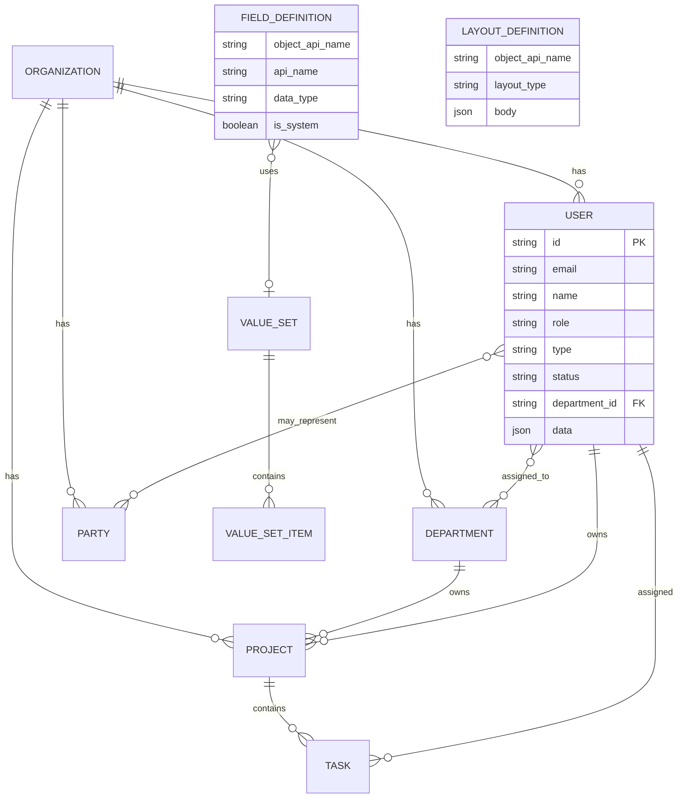

# State: I5.6 Zone ERD + baseline persistence + zone config UI

> **Role:** Sole go-to for Mission Control zone ERD, baseline data model, and tabbed zone config UI.
> **Product:** Versa-BusinessAdmin (Mission Control) · Project #26 · Game #109
> **Doc home:** docs/production/state/
> **Map:** shape_business_admin.md

| Field | Value |
|-------|-------|
| **Feature** | I5.6 Zone ERD + backend menu tabbed config + User-pilot baseline ERD |
| **Status** | ✅ I5.6.33 Gate 3 accepted 2026-09-02. Hub / org / collab / env + Records Editor train closed. No I5.6.34+ until tasked. |
| **Last verified against code** | 2026-09-02 (Gate 3 accept; Slice G on beta) |
| **Primary code** | `business-admin-scene` hub; zone routes `/organization` `/collaboration` `/environment`; users admin |
| **Task** | #176 (closed); I5.6.33 umbrella #185 closed |

**Folded sources (2026-07-20):** keystone / zone ERD / baseline / zone-config → `__archive/pre-statefold/`.  
**Folded 2026-09-03:** I5.6.32 plans + I5.6.33 proposal + ERD alignment → `__archive/plans/`.

---

## 1. Behavior / contract

### 1.1 Product boundary (binding)

| Surface | Audience | Scope |
|---------|----------|--------|
| **Mission Control (this product)** | Business staff (later customers) | Business operating graph: Organization, Collaboration, Environment |
| **agitop** | Versa AGi operators | Agents, host Projects/Tasks, host Organization, system ops |

1. AI Agents are **only** `type: agent | human` on User — no agent-management chrome.
2. No Active Agents / Agent Status / fleet UI in this product.
3. agitop Organization may be turned off when customers use this product's Organization model; migration out of scope for now (document in system information).
4. Projects/documents inside Mission are **business** data — separate from Versa AGi agent projects unless integrated later via API/script.

### 1.2 Conceptual zones (3D hub ERD)

| Ring | Zone | Role | Route | Color cue |
|------|------|------|-------|-----------|
| Inner | **Organization** | Enterprise core — departments as spheres | `/organization` | Executive red |
| Second | **Collaboration** | Parties the org works *with* | `/collaboration` | Collab green |
| Third | **Environment** | Where / when / what is known | `/environment` | Env orange |

**Brand:** hub identity **`Versa AGi`** (not Northstar Works). Organization = inner ring; **Executive** = center sphere (hub blue). Hub nucleus behavior follows accepted I5.6 hub line (on-ring + side rest for EL; see Results) plus 2026-07-21 board deltas.

#### Organization departments (spheres)

| Node | Position (Stephen 2026-07-21 board) |
|------|-------------------------------------|
| **Executive** | **Center sphere** (hub blue) — real sphere, **not** a floating clickable label |
| **Public** | **Top** (+Y) — was Service; Public ≠ Collaboration Customer |
| Communications | Left of center (−X) |
| Dissemination | Right of center (+X) |
| Treasury | Back (−Z) |
| Production | Front (+Z) — **owns Product + Service as nested objects** (not hub spheres) |
| Qualification | Bottom (−Y) |

**Removed from hub (2026-07-21):** Service sphere, Product center/sphere, clickable Executive label, Service/Product hub→tab click shortcuts. Product and Service remain Production children in zone config only.

#### Collaboration parties

| Node | Position | Definition |
|------|----------|------------|
| Vendor | Right | AKA Service Provider |
| Customer | Front | Person or Business |
| Partner | Left | Business or Investor |
| Branch | Back | Subsidiary |

#### Environment elements

| Node | Position | Definition |
|------|----------|------------|
| Locations | Left (−x side rest) | Global address book |
| Events | Right (+x side rest) | Planned activity past/future |
| Knowledge | Back | Docs, recordings, photos, policies, research |
| Schedules | Front | When Event/Activity/Task occurs |

**I5.6.6 IA ownership (locked in product):**

- **Production** owns Product + Service as **nested zone-config objects only** (not Environment tabs; **not** hub spheres — I5.6 board 2026-07-21).
- **Executive** is the **center hub sphere** and owns Policy, Projects, Tasks in zone config.
- **Public** is the top Organization sphere (distinct from Collaboration Customer).
- **Vendor** owns Integrations.
- Nested zone tabs always expose **parent self/default** sub-tab first (I5.6.9).
- **Object Labels:** support a **Name** field on objects; Organization zone proper names are the canonical Name values (and may be used as Name).

### 1.3 Relationship policy (I5.6.4)

| Zone | Intra-zone edges | Rule |
|------|------------------|------|
| **Environment** | **Full mesh** among Event, Schedule, Knowledge, Location | All pairs may relate |
| **Collaboration** | **None** between party types | No Vendor↔Customer etc. in this model; view from Organization |
| **Organization → Collaboration** | Org **has** each party type | Org-owned links only |
| **Organization internal** | Detail deferred | Stephen later pass |

**Cross-cutting (intent):**

| From | To | Relationship | Cardinality |
|------|-----|--------------|-------------|
| Organization | Department | has | 1:N |
| Organization | Service | offers | 1:N |
| Department (Executive) | Project | owns | 1:N |
| Project | Task | contains | 1:N |
| Organization | Vendor/Customer/Partner/Branch | has | 1:N each |
| Event↔Schedule↔Knowledge↔Location | (mesh) | relates | M:N |
| Task | Schedule | scheduled_by | N:0..1 |
| Product | Integration | has | 1:N |
| Product | KnowledgeAsset | described_by | M:N |
| User | Department | assigned_to | M:N (or single FK interim) |
| User | Party | may_represent | M:N optional |

### 1.4 Baseline persistence (**BASELINE LOCKED** 2026-07-20 by Stephen)

| Decision | Value |
|----------|--------|
| Pilot object | **User** |
| Layout | Per-object **layout manager** |
| Flexible attrs | **JSON in DB** (no live DDL per custom field) |
| Sequence | **Baseline ERD first**; customs/layout stubbed until base signed |

**Storage layers:**

| Layer | Contents |
|-------|----------|
| Core columns | Stable query/index/FK fields |
| `data` JSON | Flexible / custom attribute **values** |
| Catalog tables | field_definition, layout_definition, value_set(+items) — **definitions** |

**Core entities (shape):**

- **User:** id, email unique, name, role (admin|member), type (human|agent), status, department_id nullable, timestamps, `data` JSON  
- **Organization:** id, name, `data`  
- **Department:** id, organization_id, code, name, `data`  
- **Project / Task:** org/project FKs, status, owner/assignee, priority, dates, `data`  
- **Party:** organization_id, party_kind (vendor|customer|partner|branch), name, status, `data` — no party↔party edges  

**Party purpose (locked):** Mission’s record of who the business works *with* (Collaboration zone). Not the host Versa AGi Organization table. One table + `party_kind` avoids four near-identical tables. `organization_id` = owning enterprise has this party. No party↔party edges at baseline.

- **Location / Event / KnowledgeAsset / Schedule:** organization_id, core labels/timestamps, `data`; M:N junctions preferred over JSON id arrays  
- **Product / Service / Integration / Policy:** id + org/parent FKs + name/status + `data`

**Extensibility stubs (after baseline lock only):**

```
value_set(id, api_name unique, label, description)
value_set_item(id, value_set_id, api_value, label, sort_order, active)
field_definition(id, object_api_name, api_name, label, data_type, is_system, is_required,
  default_value, value_set_api_name?, lookup_object_api_name?, sort_order, active)
layout_definition(id, object_api_name, api_name, label, layout_type, version, body JSON, is_default)
```

data_types: text | long_text | number | boolean | date | datetime | picklist | multipicklist | lookup | email | url | phone | currency  

Record JSON stores picklist **api codes**; UI resolves labels from catalog.

**Build sequence:**

| Step | Deliverable | Gate |
|------|-------------|------|
| **A** | Baseline ERD signed | **LOCKED 2026-07-20** — Organization + Party(party_kind); host AGi org not shared |
| **B** | Stub catalog fixtures/tables | After A |
| **C** | User pilot: core + data JSON + layout-driven view/edit + 1–2 picklists | After B |
| **D** | Roll pattern to Project/Task/Product/… | After C |

**Non-goals for B–C (baseline locked):** custom-field admin polish, dynamic DDL, multi-object layout builders. Host AGi Organization table is **not** shared with Mission Party.

### 1.5 Zone config UI pattern

- Backend menu entries for three zones; each opens tabbed config (tabs = elements).
- Entity tabs: **listing table + collapsible New/Edit** (I5.6.10).
- Nested parents (Executive, Production, Vendor): first sub-tab = parent **Configuration** (form), not a records list for the parent itself.
- **Organization faculty config vs list (Stephen 2026-07-22):**

| Faculty | Configuration (form, like Executive) | Record list |
|---------|--------------------------------------|-------------|
| Executive | Yes (default) | Policy, Projects, Tasks (nested) |
| Production | Yes (default) — **not** a production listing | Product, Service (nested) |
| Public | Yes | Yes (contents TBD) |
| Communications | Yes | Yes (contents TBD) |
| Dissemination | Yes | Yes (contents TBD) |
| Treasury | Yes | Yes (in addition to list; contents TBD) |
| Qualification | Yes | List TBD next pass |

- Header username → `/users` until User layout pilot ships profile surface.

### 1.6 3D hub interaction (keystone + accepted I5.6 line)

- Expand toggle → lightbox fuller-screen (not F11).
- Labels billboard to camera.
- Legend toggles zone visibility (Organization / Collaboration / Environment).
- Hub center = Executive sphere; no clickable floating Executive label; no Service/Product hub spheres.
- EL side rest: Events +x / Locations −x, phase 0 static; on-ring with KS (I5.6.26 accepted direction).
- I5.6.27 anim phase offset **rejected** (intersections); I5.6.28 restored plain orbit.
- **Hub visual notes CLOSED 2026-07-20** (Stephen): treat I5.6.22 / I5.6.28 line as done unless he reopens.

---

## 2. Current State

### 2.1 Why

Mission Control needs one conceptual ERD (zones + entities + relationships) and a persistence baseline before Salesforce-like custom fields/layouts. Documentation had sprawled across keystone, zone ERD, baseline draft, and UI pattern files.

### 2.2 Behavior today vs contract

| Area | Today | Contract |
|------|-------|----------|
| 3D hub zones/entities | Implemented through I5.6.28 on **beta** | Matches keystone + I5.6 IA with accepted hub tweaks |
| Zone tabbed mocks | **Implemented 2026-09-01**: live records via Records Editor + org-type lists (I5.6.33) | Listing pattern documented; Executive form lag OK |
| Baseline ERD | Folded baseline content | **LOCKED 2026-07-20**; A1–A4 optional defaults apply |
| Catalog / User pilot layout | catalog.ts + layout-to-fields + /users pilot | ERD-C shipped; session-local mock write |
| Storage tech | **Implemented 2026-09-01**: Postgres (migrations 0001-0005 applied on VM) + fixture mode for beta :3200 | JSON-in-DB for flexible attrs (locked) |

### 2.3 Code anchors

- Hub / scene: Mission Control 3D components (beta `1f9de1a` v0.7.45 line)
- Zone pages: `/organization`, `/collaboration`, `/environment`
- Users: admin users path
- Specs archive: `docs/production/state/__archive/pre-statefold/`

### 2.4 Mermaid — baseline + stubs



---

## 3. Target State

- Single living state doc (this file) is ERD + UI + persistence SoT.
- Step A **LOCKED 2026-07-20** (Stephen go-ahead; Party purpose confirmed; host org not shared).
- Steps B–C: catalog stubs then User pilot on core + JSON + layout-driven forms.
- Hub visuals closed; I5.6.22 N/A unless reopened.
- Defaults A1–A4: single department_id; native status/role v1; fixtures/JSON first; /users + /users/[id].
- Zone config UIs align with listing pattern across entities.

---

## 4. Backlog / Plan

| ID | Work item | Acceptance | Status |
|----|-----------|------------|--------|
| ERD-A | Stephen formal lock of baseline (this doc §1.4) | Explicit lock or edits applied | ✅ LOCKED 2026-07-20 |
| ERD-A1 | Optional: single department_id vs M:N only | Decision recorded here | ✅ default: single department_id v1 |
| ERD-A2 | Optional: status/role native enum vs value_set v1 | Decision recorded | ✅ default: native columns v1 |
| ERD-A3 | Fixture/JSON on beta first vs Postgres JSONB | Decision recorded | ✅ default: fixtures/JSON first |
| ERD-A4 | Profile route `/users` vs `/users/[id]` vs `/profile` | Decision recorded | ✅ default: /users + /users/[id] |
| HUB-V | Final visual on I5.6.28 restored EL orbit | Stephen OK or tweak | ✅ closed 2026-07-20 |
| HUB-UI | I5.6.22 visual notes → UI dial | Notes applied or N/A | ✅ closed N/A 2026-07-20 |
| ERD-B | Stub value_set / field_definition / layout_definition | Fixtures or tables readable by app | ✅ fixtures `src/lib/fixtures/catalog.ts` |
| ERD-C | User pilot layout-driven view/edit + picklists | Demo on beta | ✅ layout-driven /users + /users/[id] |
| ERD-D | Roll pattern to Project/Task/Product | Same pattern | ✅ catalog+list/detail |
| UI-Z | Zone listing pattern parity (non-Executive) | Matches ZONE pattern | ✅ shared EntityListing |
| DOC-S | Point handoffs/checklists at this state doc | No parallel live ERD specs | done 2026-07-20 |
| DB-CUT | DB cutover checklist (fixture to Postgres) | Living checklist drafted, Stephen review | [state_db_cutover_checklist.md](state_db_cutover_checklist.md) -- **implemented 2026-09-01** (I5.6.33: migrations 0001-0005 on VM Postgres; fixture mode retained for beta :3200) |

---

## 5. Results Feedback

| Date | Scenario | Result | Follow-up |
|------|----------|--------|-----------|
| 2026-07-20 | Stephen locked baseline; Party purpose clarified; host org not shared with parties | Proceed ERD-B |
| 2026-07-20 | Stephen: hub visual notes DONE — no further hub polish unless reopened |
| 2026-07-20 | COA: baseline Party(party_kind) matches single-table+type spirit — recommend lock; await explicit word |
| 2026-07-20 | Stephen: ERD plan looks great, approved; revisit I5 draft; need statefold | Acked; statefold created; I5 keystone/zone/baseline/UI folded | Await formal lock + hub visual |
| 2026-07-20 | I5.6.28 rollback EL anim −π/2 | Shipped; intersections fixed vs I5.6.27 | Visual confirm |
| 2026-07-20 | I5.6.26 on-ring EL side rest | Stephen side rest good | Locked direction |
| 2026-07-20 | Baseline draft 7c45060 | Draft for lock | Superseded as living doc by this state file |

---

## 6. Change Log

| Date | Change | Items |
|------|--------|-------|
| 2026-07-20 | I5.6 UI wrap complete + Web-dev formal setup | Stephen wrap; web-dev own clone agent/web-dev @ 7fc2cb1; model deepseek/deepseek-v4-pro; duties+brief under docs/handoff/ |
| 2026-07-22 | Org zone config IA: Production→Configuration; Public/Comms/Dissemination/Treasury Config+list; Qualification Config; list defs TBD | Stephen voice; COA zone-definitions + state |
| 2026-07-21 | Org-board: Executive center sphere; Public +Y; drop Service/Product hub spheres + clickable Executive label; Object Label Name | Stephen voice brief; COA on beta |
| 2026-07-20 | ERD-D roll User pattern to Project/Task/Product | catalog value sets/fields/layouts + /projects /tasks /products list+detail; sidebar nav |
| 2026-07-20 | UI-Z zone ListingPanel → shared EntityListing (parity with Users) | zone-config-view + entity-listing hoist InlineForm |
| 2026-07-20 | ERD-C User pilot: catalog-driven listing + detail/edit layouts; finish-before-webdev per Stephen | /users, /users/[id], layout-to-fields, LayoutDrivenForm |
| 2026-07-20 | ERD-B catalog stubs shipped (`src/lib/fixtures/catalog.ts`) | value_set, field_definition, layout_definition for User |
| 2026-07-20 | BASELINE LOCKED — Party model confirmed; A1–A4 defaults; ERD-B start | Stephen voice go-ahead |
| 2026-07-20 | Hub visuals closed per Stephen; Party simplicity recommendation sent; baseline still awaiting explicit lock |
| 2026-07-20 | Statefold created; Stephen ERD plan approval recorded | Folded keystone + zone ERD + baseline I5.6.23 + UI pattern; archive copies under `__archive/` |
| 2026-07-20 | Prior baseline draft authored (I5.6.23) | User pilot, JSON-in-DB, layout + value_set stubs |
| 2026-07-19 | Zone ERD + IA I5.6.0–I5.6.10 | Mesh env, no collab cross-party, Production/Executive/Vendor ownership |
| 2026-07-18 | Keystone v1.1 from Stephen notes | Zones, glossary intent, boundary vs agitop |

---

## 7. Glossary (short)

| Term | Meaning |
|------|---------|
| Organization zone | Inner circle — departments |
| Collaboration zone | Parties: Vendor, Customer, Partner, Branch |
| Environment zone | Locations, Events, Knowledge, Schedules |
| Party | Collaboration supertype |
| KnowledgeAsset | Documents, recordings, photos, policies, research |
| Schedule | Agreement of when something occurs |
| Layout manager | Per-object UI layout definitions (data-driven) |
| value_set | Shared picklist catalog |

---

## 8. Nav remap (from keystone)

| Legacy / prior | Maps to |
|----------------|---------|
| Integrations | Vendor → Integrations |
| Projects / Tasks | Executive → Projects / Tasks |
| Settings | as-is |
| Users | as-is (`/users`) |
| Dashboard | as-is |
| Active Agents / Agent Status | **removed** (agitop only) |

## I5.6.31 — Twin drawer (zone chrome, not ERD)

Spatial twin on zone config pages is optional chrome (drawer + persistence). Does not change zone graph, tabs, or records IA. See `state_layout_mission_ui.md`.

## I5.6.32 — Menu IA + dynamic records direction (2026-07-22)

**Nav:** Projects, Tasks, Products removed from main sidebar (zone-owned under Executive / Production). Routes retained for deep links. Shortcuts later.

**Qualification:** Configuration + Records (parity with Public/Comms/Dissemination/Treasury).

**Dynamic records:** Faculty Records become config-driven types over time. **Projects & Tasks stay first-class tables** (FK/perf) — catalog layouts may still drive their forms. Historical plan: `__archive/plans/I5_6_32_DYNAMIC_RECORDS_REDESIGN.md`.

## I5.6.32b — Catalog schema API (2026-07-22)

Agents/UI can **read** object schema via authenticated `/api/catalog` (objects, fields, layouts, value-sets) and **extend** with `POST /api/catalog/fields` (admin; fixture-local until catalog tables persist). Typed cores remain first-class; faculty record types registered in object registry for 32c.


## Twin + zone chrome — Stephen 2026-07-24 recovery

| Rule | Contract |
|------|----------|
| Zone twin motion | **Static** (`animSpeed=0`) on Organization, Collaboration, Environment. Dashboard hub may keep Speed control default 0. |
| Twin content | Active zone / focused element only (existing cameraFit + focusedNode). |
| Zoom | Keep current per-zone camera fit — Stephen confirmed OK. |
| Nested sub-tabs | If primary tab shows count badge, `SubTabBar` (Configuration + children) **must** be visible. |
| Description once | Faculty/tab summary text once per view — no duplicate under sticky + inside FormPanel header. |

Living layout chrome detail: `state_layout_mission_ui.md` § I5.6.35.


## I5.6.33 — Zone elements, record types & schema ERD (2026-08-31, LOCKED rev E)

**Schema LOCKED at rev E** (d4659b7, beta) after Stephen's C1–C8 verdict. Full spec:
\`docs/production/state/__archive/plans/I5_6_33_ZONE_ELEMENTS_ERD_PROPOSAL.md\` (folded 2026-09-03). #218 (7cc408f) seeded 6 system record types +
26-field catalog + 7 value sets; baked listing tabs wired; sampleRows mocks removed.

Locked decisions:
- **Senior pattern:** elements are record TYPES (many instances, each header + lines); lookups
  between definitions (cascade = master-detail | orphan = plain, default orphan); system types
  locked (\`is_system\`), custom types via the same mechanism, three-zone landing.
- **Multi-org:** **superseded 0.7.107.** There is one Org-type record — the **Primary Org** (`is_primary`). The flag is one-time and cannot be changed. Only one `org_type=internal`. All `org_id` fields (system and dynamic types) resolve from that Primary Org. This product is **not** multi-tenant org login: customers of the org buy Mission Control; they do not log in as orgs viewing themselves. Collaboration parties are vendor / customer / partner / branch.
- **Executive division** = Policy + Projects + Tasks (one-to-many to all 4 parties + 4 env nodes).
- **C3:** standalone vendor_integration RETIRED → lines group on vendor instances.
- **C4:** policy version control dropped (no new_version checkbox / supersedes lookup).
- **C5:** organizations stay typed core table, extended is_person / org_type / parent_organization_id.
- **C6:** collaboration zone renders organizations by org_type. Branch lists children of the Primary Org. Collaboration orgs theoretically have all seven divisions but we do not model them here.
- **C7:** no dissemination_campaign — campaigns fold under promotion & marketing (header + lines).
- **C8:** zone/element api_name prefixes kept.
- **Horizon 1 tables:** record_type, record, record_line, record_relations + lookup_delete_rule
  + element_config.
- 40-hint cross-element matrix: **HELD by Stephen** (returns after these changes settle).

Slice progress (web-dev, #185/#246, rev E locked):
- **Slice A DONE** (285c139, Gate 2 PASS): structure corrections executive_project/task,
  production_product/service list→header_lines + list→detail views; rev E §4.2 line fields.
- **Slice B DONE** (0e8dda3, Gate 3 amendment): policy renders list-to-detail like all
  header_lines types (COA ruling D3 superseded the executive_policy exclusion).
- **Slice C DONE** (#246, 2026-08-31): 15 new system types seeded (all structure=list) +
  fields for all 15 objects; value sets message_type, treasury_transaction_classification
  (income|disbursement), contact_kind (staff|public — flagged decision F1, from the rev D
  Distribution note); baked listing children wired for Communications (messages/reports/staff),
  Dissemination (sales/promotion-marketing), Treasury (transactions/records-assets-materiel),
  Qualifications (examinations/reviews/certifications-awards), Distribution (contacts);
  environment element tabs (locations/events/knowledge/schedules) wire at element level
  (§7.6 — the tab itself carries the dynamic path; selfPanel keeps it on the self panel);
  Public renamed to Distribution (rev D; tab id stays `public` per C8). vendor_integration
  stays seeded+wired per D1 until Slice F cutover. Sanity: 166 assertions pass.
- **Slice D DONE** (#248, 8137ea0 on 3f65be0, Gate 1 delivered): organizations extended
  is_person / org_type (vendor|customer|partner|branch|internal VS + CHECK) /
  parent_organization_id self-FK (set => branch); migration 0001 defaults existing orgs to
  internal. Collaboration vendor/customer/partner/branch tabs render live organizations via
  OrgTypeListingPanel (mocks removed); branch filters by parent_organization_id = user default
  org; vendor/customer/partner unfiltered until record.org_id lands (Slice E2 - FLAGGED to COA).
  Executive self tab renders OrganizationsPanel (Gate 3 verdict 2: list replaces header form)
  with CRUD + user default_organization_id setting (PATCH /api/users/:id). Sanity 44/44.
- **Slice E1 DONE** (#245, Gate 1 delivered 2026-08-31): Horizon 1 core persistence -
  record_type/record/record_line/record_relations tables + field_definition.lookup_delete_rule
  (C2: NULL reads orphan, cascade opt-in) in migration 0002; seeded system types migrate into
  record_type rows on first records read/write (21/21, is_system=true, idempotent upsert);
  fixture-era NULL line_group rows backfill to the type's first group on read (COA note 3827;
  policy keeps its legacy NULL default group); records API persists through the new tables
  behind DATA_SOURCE=postgres (fixture path unchanged, meta.persistence=horizon1_db);
  record_line carries nullable organization_id (C3 design note - exactly-one-parent CHECK)
  pending Gate 1 confirmation. Sanity 60/60; live smoke 22/22 against VM Postgres (migrated,
  verified, environment restored).
- **Slice E2 DONE** (#249, Gate 1 delivered 2026-09-01): element_config table (singleton per
  org + element_api_name, head_user_id + deputy_user_id + config JSONB, migration 0003) +
  element-config store + GET/PUT /api/element-config/[element] (admin-gated writes);
  DivisionConfigPanel on all 7 division self panels (Executive keeps OrganizationsPanel per
  Gate 3 verdict 2, config panel renders beneath); org auto-preset (rev E section 2.5) -
  create resolves explicit org_id > user default_organization_id (users.data JSONB) > type org,
  org_id user-changeable per record (PATCH validated, ORG_NOT_FOUND/ORG_REQUIRED), instance
  shape carries org_id, FormPanel detail view renders org dropdown (editable when multiple
  orgs, read-only when one); executive one-to-many relations (rev E section 3.2 + C5) -
  record_relations.target_record_id now nullable + target_organization_id column + XOR CHECK
  (exactly one target), relations write paths on create/update (replace-in-full), batched
  read path with resolved target names, GET /api/records/[id]/relations returns outbound +
  inbound with type labels, RecordRelationsPanel renders both ways on executive detail pages
  (policy/projects/tasks) with record deep-links to /records-editor?record=<id>. tsc/build
  clean, lint clean on touched files (15 pre-existing errors remain), sanity 45/45, live
  smoke 10/10 on VM Postgres (migrated, verified, environment restored, zero residue).
  E1 sanity scope guards updated: record-instances.ts + zone-config-view.tsx are E2-owned
  (marker-checked), record-types.ts still untouched.
- **NEXT Slice F** (#244): custom record types + three-zone landing + integrations cutover
  (D1 pairing: retire vendor_integration seed + wiring in same commit).
Gate flow per slice: Gate 1 commit → Gate 2 COA review → beta FF + :3200 → Stephen Gate 3 brief.

## I5.6.33 - Gate 3 verdict + full WBS (2026-08-31 16:55 EDT)

**Stephen Gate 3 verdict (msg j10tvs2UgJy0JMsR6DrL):**
- UNIVERSAL shape rule: no header/config forms anywhere - every tab = list of records, each
  with optional lines. Policy renders like projects/tasks (supersedes ruling D3).
- Executive hosts the organizations list (no header form there either).
- Collaboration tabs = organization-type lists (views on organizations, default-org filter) -
  as rev E section 2.7 / C6 already designed.
- Full-WBS authorization: do WHATEVER is needed to get through all the work, multiple passes
  if needed, the most reliable way. Drip-feed ended; continuous run mode.

**WBS (web-dev, sequenced, COA reviews batched per pass):**
- #247 Slice B - policy list-to-detail rendering (D3 superseded). Due Sep 1
- #246 Slice C - 15 new system types + 2 value sets, baked-tab wiring. Due Sep 2
- #248 Slice D - organizations extension (is_person / org_type / parent_organization_id) +
  collaboration rendering + default org + Executive organizations list. Due Sep 3
- #245 Slice E1 - Horizon 1 core persistence (record_type / record / record_line /
  record_relations + lookup_field; org-attached lines design note at Gate 1). Due Sep 4
- #249 Slice E2 - element_config (head + deputy) + org auto-preset + executive relations. Due Sep 5
- #244 Slice F - custom record types + three-zone landing + integrations cutover
  (D1 pairing: retire seed + wiring in same commit). Due Sep 7
- #250 Slice G - final smoke + docs to implemented + Stephen final review. Due Sep 8

Gate flow: Gate 1 commit -> Gate 2 COA review (batched per pass) -> beta FF + :3200 ->
Stephen briefs at pass boundaries. Beta only, no production.

## I5.6.33 — Stephen beta feedback round 2 (2026-09-01, msg int_5ffc02458e2a426a)

10-item list, dispositioned and committed to the WBS. Full text preserved in message log.

| # | Item | Disposition |
|---|------|-------------|
| 1 | Hub element height fill to viewport bottom | NEW — UI fix, fold into remaining slices |
| 2 | Executive shows 'Not authorized', no org records | Covered — orgs list lands with Slice E2 (due Sep 5); auth gate. Re-check post-E2 |
| 3 | Rename 'Configuration' → 'Records' on all zone sub-tabs (incl. Executive) | ACCEPTED — global rename, folded into remaining slices |
| 4 | Sub-tab mislabeling: Distribution shows Communication's tabs; Communication shows Dissemination's; Dissemination shows Treasury's; Treasury shows Qualifications'; Qualifications shows Distribution's | BUG CONFIRMED — off-by-one wiring in baked-tab wiring (Slice C); fix in next slice |
| 5 | Collaboration: 'Records' under each org-type tab (Org/Vendor/Customer/Partner/Branch) | COVERED — Slice E2/F per rev E §2.5/C6 (org-type lists, default-org filter) |
| 6 | Records Editor New Field: proper data-type labels; Value set + Lookup fields conditional on Lookup/Picklist/Multi-Picklist; clarify multipicklist naming | ACCEPTED — UX refinement, fold into remaining slices |
| 7 | Glossary: UX consistent with other sections; rename Configuration → Records on both tabs | ACCEPTED — rename global; glossary UX polish folded in |
| 8 | Users: rename Configuration → Records | ACCEPTED — global rename |
| 9 | Records Editor: rename Configuration → Records | ACCEPTED — global rename |
| 10 | Settings: rename Configuration → Records AND implement functionality | NEW SCOPE — size + slot after current build, before final smoke (Slice G) |

Rule: no piecemeal dispatches; all items ride the remaining slices (E2 → F → G) + a Settings
functionality slice slotted before G. Stephen gets the consolidated smoke brief at completion.

## I5.6.33 - Slice F delivery (2026-09-01, commit ab34558, #244)

Custom record types + org-attached integrations lines + D1 cutover. Branch agent/web-dev
(on 664b378), pushed origin. Beta only, nothing to production.

**Delivered:**
- D1 cutover: vendor_integration record type retired (seed, 4 catalog field defs, BAKED
  wiring). Vendor integrations = org-attached record_line rows (line_group=integrations)
  per C3 design note. Migration 0004 migrates existing rows to the owning org
  (record.org_id) and retires the record_type row (records cascade). Applied on VM
  Postgres: type row retired, zero records existed to migrate.
- Org-attached lines stack: records-store CRUD (keyed org+group; E1 XOR CHECK guarantees
  single parent), adapter interface + fixture + postgres implementations,
  GET/POST/PATCH/DELETE /api/organizations/[id]/lines (admin-gated writes).
- OrgLinesPanel on vendor Integrations child: aggregates lines across orgs of the parent
  tab type; Vendor select chooses owning org; render/add/update/delete via ListingPanel.
- Latent Slice D bug 1: TabPanel selfPanel forwards orgTypePanel (was unreachable - collab
  tabs rendered legacy form) + orgLinesGroup; self label Configuration -> Records
  (Stephen round-2 item 3, zone pages).
- Latent Slice D bug 2: fixtureAdapter organizations methods (in-memory store mirroring
  postgres VALIDATION semantics) - /api/organizations no longer 501 in fixture mode
  (beta :3200 runs fixture mode).
- Zone children off-by-one rotation fixed (public<-contacts, communications<-messages/
  reports/staff, dissemination<-sales/promotion-marketing, treasury<-transactions/
  records-assets-materiel, qualification<-examinations/reviews/certifications-awards) -
  Stephen round-2 item 4; restores live-records wiring (BAKED_TAB_SYSTEM_TYPES matches
  parent_api_name===tab.id).
- F1 custom types: label-unique-within-parent check in createRecordType (rev E 2.4,
  LABEL_EXISTS).
- F4 lookup_delete_rule: FieldDefinition + ExtendFieldInput + validation (cascade|orphan,
  default orphan per C2), fields route passthrough, Records Editor create + edit selects.
- E2-3 deep-link consumer: /records-editor?record=<id> expands owning type.

**Validation:** tsc clean; build clean; lint rule-clean on new code (pre-existing errors
unchanged: 3 in records-editor/zcv, 1 localStorage effect pre-existing); sanity A47 /
C166 / D44 / E1-60 (scope-guard updated: record-types.ts now F-owned) / E2-45 / F-56;
live smoke 7/7 on VM Postgres (migrate, CRUD, XOR CHECK, zero residue).

**Flags for Gate 2 (F1-F4):** F1 OrgLinesPanel fetches lines per-org in parallel (N+1
fetches, acceptable at current org counts; batch endpoint if org counts grow). F2
migration 0004 deletes the vendor_integration record_type row directly (records cascade)
- applied on VM already; COA confirm no other environments hold vendor_integration
records. F3 fixtureAdapter org store is session-memory only (resets on restart) - matches
existing fixture semantics. F4 sanity E1 scope-guard now asserts record-types.ts carries
#244 markers (F-owned) instead of untouched.


## I5.6.33 - Settings functionality slice delivery (2026-09-01, commit d0c94d2, #252)

**Scope (Stephen round-2 item 10, slotted before G per locked sequence):** make the
exposed Branding controls real + 2 Settings sub-tab label renames. COA GO on flags
S1-S6 (int_48f133a0f89b45c1).

**Delivered:**
- site_settings singleton (migration 0005: id text PK, brand_name, brand_color,
  updated_at; single row keyed id=site). Applied on VM Postgres, zero residue.
- settings-store (postgres) + fixture singleton (S5: seeded from static theme when
  unset). Fixture store is globalThis-backed - Next.js server bundles duplicate
  module-level state across layout/route bundles (observed live: PUT updated the
  route bundle copy while the layout rendered its own stale copy); globalThis is
  shared across bundle instances in one server process, so PUT -> hard reload sees
  the new brand.
- GET auth'd + PUT admin-gated /api/settings/branding (S3, element-config precedent):
  hex color validation (INVALID_BRAND_COLOR), non-empty brand_name
  (INVALID_BRAND_NAME), partial updates merge over current values.
- S4 server-read: root layout is force-dynamic, reads brand per-request (try/catch
  fallback to static theme - branding failure never takes the app down), passes to
  BrandProvider. Acceptance: PUT a new brand, hard-reload login + sidebar, new brand
  appears WITHOUT rebuild/restart.
- S2 identity surfaces only: sidebar (logo box, name, footer version line), login
  (logo box, name), settings (badge, accent, preview, Save). 88 static
  theme.colors.brand usages in 27 files untouched (full dynamic theming = future
  slice if Stephen asks).
- Branding Save is now REAL: PUT /api/settings/branding, error surface
  (role=alert), saving state, disabled while saving. Plain inputs replace base-ui
  Input on the Branding controls (base_ui_input_focus_bug reminder).
- Rename: both Settings sub-tab labels Configuration -> Records (branding +
  appearance panels), ids stable. Glossary 2 + users 1 + records-editor 4 labels
  stay Slice G per locked scope.

**Validation:** tsc clean; build clean (all routes dynamic - force-dynamic verified
at build level); lint clean on all 9 touched files; sanity 49/49 (new
sanity_slice_settings.ts); VM Postgres smoke 8/8 (table shape, S5 unset-defaults,
insert + update paths, zero residue); prior suites green: A47 / C166 / D44 / E1-60 /
E2-45 / F-56.

**Flags for Gate 2 (S1-S6 already ruled; new observations):** (1) fixture branding
persistence is process-lifetime only - resets on :3200 restart (matches fixture
semantics; postgres path is durable). (2) brandInitials derives 2-letter initials
for custom names, keeps static shortName for the default brand (matches settings
preview). (3) metadata.title stays static this slice (S6).

## I5.6.33 - Slice G delivery (2026-09-01, #250) - final integration pass

Final slice of the I5.6.33 train. Carried scope from Stephen round-2 + integration
closeout. ERD proposal status flipped to implemented (see section 2.2 + backlog
DB-CUT row).

**Delivered:**
- Item 1 (hub height): Mission Control hub scene now fills to the viewport bottom -
  scene Card grows (flex min-h-0 flex-1), CardContent flex column, scene
  min-h-[375px] flex-1 (375px floor kept, hardcoded fixed height removed). Matches
  the zone-page fill pattern (min-h-0 flex-1 wrapper + scene fill mode).
- Item 6 (Records Editor field form): DATA_TYPES now labeled + grouped (Text /
  Numeric / Date and time / Choice / Relation optgroups; wire values unchanged);
  picklist naming clarified (single choice / multiple choices suffixes); Value set
  field shows only for picklist/multipicklist, Lookup object only for lookup
  (showWhen pattern, same as delete rule); createField nulls stale conditional
  values when data_type switches.
- Items 7/8/9 (rename sweep): glossary 2 + users 1 + records-editor 4 sub-tab
  labels Configuration -> Records; ids stay configuration (deep-link stable).
  With Settings (#252) the global rename is complete.
- Version bump 0.7.70 -> 0.7.71 (package.json; sidebar footer reads it).

**Validation:** tsc clean; build clean; lint on 5 touched files adds zero new
problems (6 pre-existing verified via stash test); sanity G-20 (new suite) + prior
suites A47 / C166 / D44 / E1-60 / E2-45 / F-56 / Settings-49 all green; live smoke
on :3305 (prod build, fixture mode): login 200, glossary/users/records-editor SSR
shows Records labels with zero Configuration labels, dashboard SSR carries the new
flex classes and no hardcoded fixed height; server shut down cleanly (no orphans).

**Integration status:** Slices B/C (Gate 2 passed pre-round-2), D (#248), E1 (#245),
E2 (#249), F (#244), Settings (#252) all Gate-2-passed and FF'd to beta through
d8c6c51; Slice G is the final train slice.

## I5.6.33 — Gate 3 accept (2026-09-02)

Stephen accepted the train in IDE: hub-height + records coverage; 2026-08-31 ERD alignment was the design lock the train implemented. Tasks #185 / #244 / #245 / #248 / #249 / #250 / #252 closed. Do not start I5.6.34+ until tasked.

## 0.7.107 — Primary Org, Receipts name, Environment ERD direction (2026-09-03)

Stephen confirmed the three-zone reading (IDE 2026-09-03):

1. **Organization (“us”).** Seven divisions. One Org-type record is **Primary Org** — a one-time fixed flag on a single record; cannot be changed; cannot be deleted. There can be only one `org_type=internal`. All `org_id` fields are set from that org (keep the global `org_id` field). Not a design for orgs logging in to view themselves.

2. **Collaboration.** Other organizations, seen as relationships. Customer-side equivalent of vendor **Integrations** is named **Receipts** (docs only — do not build a tab until tasked). Collaboration orgs theoretically have all seven divisions but we do not model them here.

3. **Environment.** UI still undesigned; leave last. Relational direction for a later ERD: locations can have events and knowledge; events can have schedules; events and locations can have knowledge; events, knowledge, and locations have orgs.

**Dynamic types:** same `org_id` rule as system types.

**Sample data (planned, not built this pass):** Demo mode does not swap the backend onto fixtures. Preferred approach is a global `external_id` column plus **Insert Sample Data** / **Delete Sample Data**, so operator tables stay empty unless you create rows (or insert tagged samples).

**Code:** `src/lib/organizations/primary-org.ts`, adapters, `records-store.resolveOrgIdForCreate`, Organization **Configuration** main tab (`PrimaryOrgPanel` + staff appointment).

