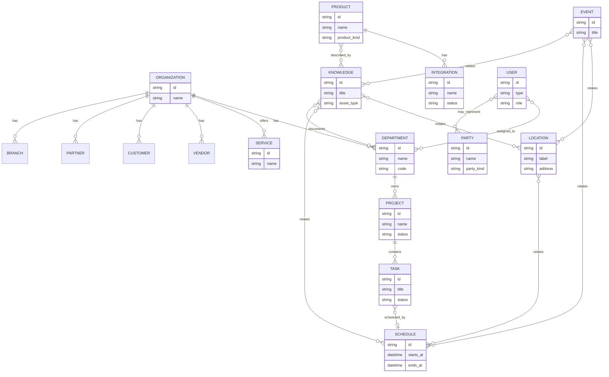

# Mission Control — Zone Entity ERD (I5.6 basic)

**Status:** Draft v0.2 — I5.6.4 relationship rules (2026-07-19)
**Project:** versa-admin-system (#26) · Game #109
**Builds on:** `MISSION_CONTROL_ERD_KEYSTONE.md` v1.1
**Author:** Versa (COA)
**UI companion:** Backend menu → `/organization`, `/collaboration`, `/environment` (tabbed config mocks)

---

## 1. Purpose

Basic entity-relationship chart for the three Mission Control zones so we can:

1. See every element on one diagram
2. Define relationships between zones
3. Drive the **backend menu + tabbed config UI** (one surface per zone; tabs = elements)

This is a **conceptual ERD** (product model), not a locked SQL schema. Storage technology remains undecided.

---

## 2. Zone summary

| Zone | Route | Color cue | Elements (tabs) |
|------|-------|-----------|-----------------|
| **Organization** | `/organization` | Executive red | Executive, Communications, Dissemination, Treasury, Production, Qualification, Service |
| **Collaboration** | `/collaboration` | Collab green | Vendor, Customer, Partner, Branch |
| **Environment** | `/environment` | Env orange | Locations, Events, Knowledge, Schedules, Product (+ Integrations under Product) |

> **Product** sits at the hub in the 3D viz and is the nucleus for offerings; **Service** is modeled as Organization faculty in the live hub. **Integrations** always nest under Product.

---

## 3. Entity catalog

### 3.1 Organization zone

| Entity | Kind | Notes |
|--------|------|--------|
| **Organization** | Aggregate | The enterprise; owns departments |
| **Department** | Entity | Executive, Communications, Dissemination, Treasury, Production, Qualification |
| **Service** | Entity | Faculty for results (e.g. Analysis & Design) |
| **Project** | Entity | Lives under Executive (nav remap) |
| **Task** | Entity | Lives under Project |

### 3.2 Collaboration zone

| Entity | Kind | Notes |
|--------|------|--------|
| **Party** | Supertype | External or structural relationship party |
| **Vendor** | Party | AKA Service Provider |
| **Customer** | Party | Person or Business |
| **Partner** | Party | Business or Investor |
| **Branch** | Party | Subsidiary |

### 3.3 Environment zone

| Entity | Kind | Notes |
|--------|------|--------|
| **Location** | Entity | Global address book (+ future maps) |
| **Event** | Entity | Planned activity past/future |
| **KnowledgeAsset** | Entity | Docs, recordings, photos, policies, research |
| **Schedule** | Entity | When an Event / Activity / Task occurs |
| **Product** | Entity | Device, manufactured item, or computer file — hub nucleus |
| **Integration** | Entity | Always under Product |

### 3.4 Cross-cutting

| Entity | Kind | Notes |
|--------|------|--------|
| **User** | Entity | type: human or agent — only agent distinction |
| **Setting** | Entity | Product settings (as-is nav) |

---

## 4. Relationships (I5.6.4 rules)

### 4.0 Zone relationship policy (Stephen 2026-07-19)

| Zone | Intra-zone edges | Rationale |
|------|------------------|-----------|
| **Environment** | **Full mesh** among Event, Schedule, Knowledge, Location | An event can have a schedule, knowledge, and location; knowledge can be gained at a location or on a schedule; locations/schedules relate to events, knowledge, and each other. |
| **Collaboration** | **None** between Vendor, Customer, Partner, Branch | Parties are distinct. Vendor↔Customer (etc.) may exist in the real world but are **not captured** here — we view this layer from the executive Organization zone. |
| **Organization → Collaboration** | Org **has** each party type | Organization can have a branch, partner, customer, and vendor. Those are org-owned links only. |
| **Organization** | (detail deferred) | Stephen will specify org internal model in a later pass. |

### 4.1 Relationship table

| From | To | Relationship | Cardinality (intent) |
|------|-----|--------------|----------------------|
| Organization | Department | has | 1 : N |
| Organization | Service | offers | 1 : N |
| Department (Executive) | Project | owns | 1 : N |
| Project | Task | contains | 1 : N |
| Organization | Vendor | has | 1 : N |
| Organization | Customer | has | 1 : N |
| Organization | Partner | has | 1 : N |
| Organization | Branch | has (subsidiary) | 1 : N |
| Event | Schedule | relates | M : N |
| Event | KnowledgeAsset | relates | M : N |
| Event | Location | relates | M : N |
| KnowledgeAsset | Location | relates | M : N |
| KnowledgeAsset | Schedule | relates | M : N |
| Location | Schedule | relates | M : N |
| Task | Schedule | scheduled_by | N : 0..1 |
| Product | Integration | has | 1 : N |
| Product | KnowledgeAsset | described_by | M : N |
| User | Department | assigned_to | M : N |
| User | Party | may_represent | M : N |

> **Explicit non-edges (Collaboration):** Vendor↛Customer, Vendor↛Partner, Vendor↛Branch, Customer↛Partner, Customer↛Branch, Partner↛Branch — and reverse. Do not model party-to-party graphs in this layer.

---

## 5. Mermaid ERD (basic chart)

---

## 6. UI pattern (locked direction from Stephen)

- **Menu:** three zone entries in the backend sidebar (Organization, Collaboration, Environment).
- **Each zone page:** config surface with **tabs = elements** in that zone.
- **Within a tab:** configure that element and show **relationship hooks** into the other two zones.
- **3D hub** remains the spatial ERD; these screens are the operational twin.

### Tab map (mock v0.1)

**Organization:** Executive · Communications · Dissemination · Treasury · Production · Qualification · Service

**Collaboration:** Vendor · Customer · Partner · Branch

**Environment:** Locations · Events · Knowledge · Schedules · Product

*(Integrations remain under Product nav group for now; Product tab notes Integrations.)*

---

## 7. Out of scope (this pass)

- Production database / migrations
- Full CRUD APIs per entity
- agitop agent fleet chrome
- Pixel-perfect design system polish beyond a strong mock

---

## 8. Open questions for Stephen (after 6 PM)

1. Should **Service** stay under Organization tabs only, or also appear under Environment as an offering twin?
2. **Branch** as Party only vs optional nested Organization record?
3. Preferred first **real** CRUD target after mocks (Customer vs Product vs Locations)?
4. Any entities missing from the basic chart before we deepen attributes?

---

## 9. Changelog

| Date | Note |
|------|------|
| 2026-07-19 | I5.6.0 basic ERD + tab map from Stephen next-stage brief after I5.5.16 visual accept |

